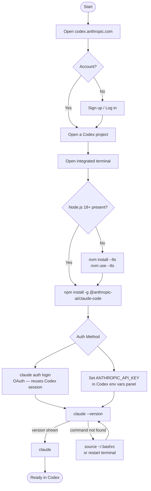

# Claude Code Installation Flow


---

## Platform: Codex (`--platform codex`)



---

## Platform: Windows (`--platform windows`)

```mermaid
flowchart TD
    A([Start]) --> B{Subsystem}
    B --> C[WSL 2\nrecommended]
    B --> D[PowerShell / CMD\nnative]

    C --> E{WSL installed?}
    E -->|No| F[wsl --install\nrestart PC]
    F --> G[wsl]
    E -->|Yes| G

    G --> H{Node.js 18+ in WSL?}
    H -->|No| I[curl -fsSL https://deb.nodesource.com/setup_lts.x | sudo -E bash -\nsudo apt-get install -y nodejs]
    H -->|Yes| J[npm install -g @anthropic-ai/claude-code]
    I --> J

    D --> K{Node.js 18+ installed?}
    K -->|No| L[Download installer\nnodejs.org/en/download]
    L --> M[npm install -g @anthropic-ai/claude-code]
    K -->|Yes| M

    J --> N{Auth Method — WSL}
    M --> O{Auth Method — native}

    N --> P[claude auth login\nOAuth browser flow]
    N --> Q[setx ANTHROPIC_API_KEY key\nin Windows env vars]

    O --> P
    O --> Q

    P --> R[claude --version]
    Q --> R

    R -->|version shown| S[claude]
    R -->|not found| T[Add npm global bin to PATH\nnpm config get prefix]
    T --> R

    S --> U([Ready on Windows])
```
