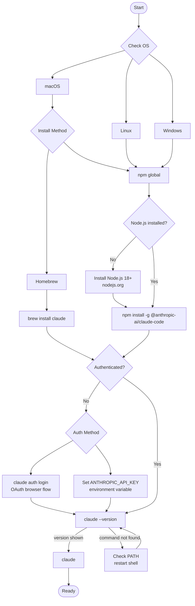

# Claude Code Installation Flow

```mermaid
flowchart TD
    A([Start]) --> B{Check OS}

    B --> C[macOS]
    B --> D[Linux]
    B --> E[Windows]

    C --> F{Install Method}
    F --> G[npm global]
    F --> H[Homebrew]

    D --> G
    E --> G

    H --> I[brew install claude]
    G --> J{Node.js installed?}

    J -->|No| K[Install Node.js 18+\nnodejs.org]
    K --> L[npm install -g @anthropic-ai/claude-code]
    J -->|Yes| L

    I --> M{Authenticated?}
    L --> M

    M -->|No| N{Auth Method}
    N --> O[claude auth login\nOAuth browser flow]
    N --> P[Set ANTHROPIC_API_KEY\nenvironment variable]

    O --> Q[claude --version]
    P --> Q
    M -->|Yes| Q

    Q -->|version shown| R[claude]
    Q -->|command not found| S[Check PATH\nrestart shell]
    S --> Q

    R --> T([Ready])
```
