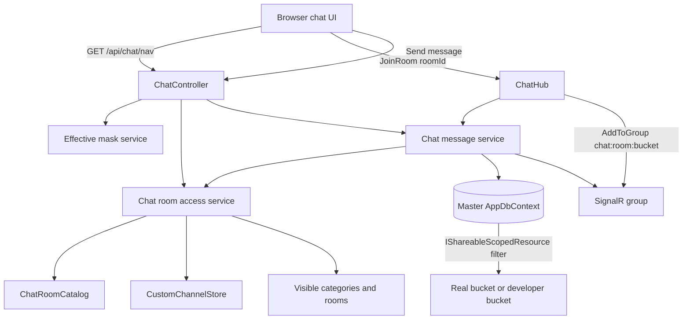
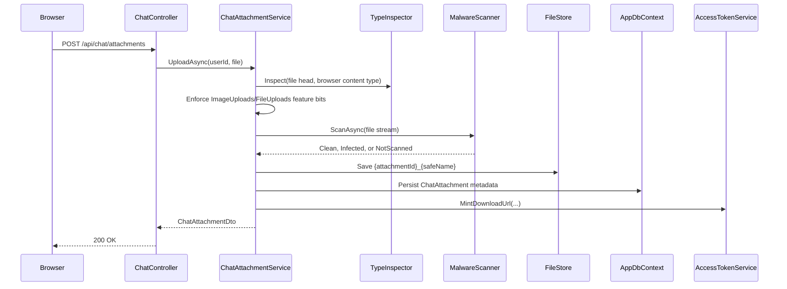
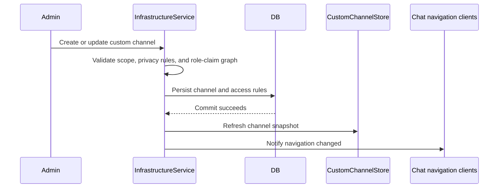

# Chat

## Purpose / Scope

Homework Central chat provides authenticated community rooms, category-based
navigation, staff and subject room gates, SignalR message delivery, typing
presence, mention inboxes, message attachments, attachment scanning, and safe
download handling. The feature combines catalog-driven rooms, custom
infrastructure channels, and attachment metadata while preserving the
real-account versus developer-traffic boundary carried by identity claims.

This document covers current behavior for:

- chat navigation categories and rooms;
- catalog and custom room access rules;
- message read, send, reply, forward, vote, mention, inbox, and typing flows;
- real/developer traffic isolation for shared chat history;
- chat attachment upload, scan, link, delete, cleanup, and download flows;
- ClamAV and null malware scanner implementations;
- `ImageUploads` and `FileUploads` feature-bit gates;
- developer bypass behavior for uploads;
- caution handling for confirmed infected attachments.

It does not cover avatars, profile media, external object storage, thumbnail
generation, or retention policies beyond the current orphan cleanup worker.

## Terminology

| Term | Meaning |
|---|---|
| Category | Sidebar grouping such as General, Mathematics, Science, Computer Science, Staff, or a custom category. |
| Room | Joinable chat destination. Catalog rooms use `ChatRoomDefinition`; custom channels use `CustomChannelSnapshot`. |
| General room | `general:lobby`; open to any authenticated user. |
| Get Roles | `general:get-roles`; appears in chat navigation but routes to a subject-claim panel instead of message history. |
| Subject room | Private catalog room backed by a subject expertise bit or by the parent general-subject bit. |
| Staff room | Private catalog room backed by a platform role bit. |
| Custom channel | Infrastructure-defined room, info page, role-claim page, or ticket portal visible through the chat navigation contract. |
| Shared scoped resource | Entity implementing `IShareableScopedResource`; EF query filters split real production traffic from developer/test traffic by `OwnerAccountClass` only. |
| Attachment | A `ChatAttachment` metadata row plus a file stored under `Uploads:RootPath`. |
| Message link | A `ChatMessageAttachment` row connecting an uploaded attachment to a chat message. |
| Orphan attachment | A `ChatAttachment` row with no message links. |
| Hazard | An attachment whose detected type is executable, archive-like, or script-like; hazards do not receive inline previews. |
| Scan status | `MalwareScanResult` stored on `ChatAttachment.ScanStatus`. |
| Caution gate | Download response behavior that requires `riskAcknowledged=true` only when scan status is `Infected`. |
| Access-token URL | A signed URL with `accessToken` query string that permits anonymous download until its cache-backed token expires. |

## Architecture

`ChatController` owns the HTTP surface:

| Endpoint | Authorization | Current behavior |
|---|---|---|
| `GET /api/chat/nav` | Bearer auth required | Returns chat categories and rooms visible to the current user. |
| `GET /api/chat/rooms/{roomId}` | Bearer auth required | Returns catalog or custom room metadata when access is allowed. |
| `GET /api/chat/rooms/{roomId}/messages` | Bearer auth required | Returns recent messages after room access and shared-traffic filters pass. |
| `POST /api/chat/rooms/{roomId}/messages` | Bearer auth required | Sends message content, replies, forwards, and owned attachments to an accessible room. |
| `POST /api/chat/messages/{messageId}/vote` | Bearer auth required | Applies a viewer vote to a chat message when the message is visible. |
| `GET /api/chat/mention-roles` | Bearer auth required | Returns mentionable role names and colors for autocomplete. |
| `GET /api/chat/users/search` | Bearer auth required | Searches users for mention and ticket intake autocomplete. |
| `GET /api/chat/inbox*` | Bearer auth required | Lists and summarizes mention/reply notifications for accessible rooms. |
| `POST /api/chat/attachments` | Bearer auth required | Uploads one `IFormFile`, validates feature bits and scope, scans, stores, and returns attachment metadata plus a signed download URL. |
| `GET /api/chat/attachments/{attachmentId}` | Bearer auth or valid `accessToken` query string | Streams the file, returns `404` when inaccessible, or returns `409` when an infected file needs acknowledgement. |
| `DELETE /api/chat/attachments/{attachmentId}` | Bearer auth required | Deletes an unattached file only when the caller uploaded it. |

`ChatHub` owns the SignalR surface for joining rooms, typing presence, and
online tracking. Hub methods re-bind `IHttpContextAccessor.HttpContext` to the
connection context before calling services that resolve the acting user's
tenant scope from the HTTP context.





### Navigation shape

```text
Chat
├── General
│   ├── General (public)
│   └── Get Roles (public; subject-claim page, not message history)
├── Mathematics
│   ├── Calculus
│   ├── Algebra
│   └── ...
├── Science
│   ├── Biology
│   └── ...
├── Computer Science
│   ├── Python
│   └── ...
├── Staff
│   ├── Tutors
│   ├── Moderators
│   ├── Admins
│   └── ...
└── Custom categories
    └── Chat, info, role-claim, or ticket rooms
```

Subject types are categories only; expertise bits are the actual subject rooms.

### Access rules

| Rule | Implementation |
|---|---|
| General (public) | `general:lobby`; any authenticated user; `IsPrivate = false`, no key icon. |
| Get Roles (public) | `general:get-roles`; any authenticated user; frontend routes it to a subject-claim panel instead of the messaging UI. Backed by `GET/POST /api/subjects/*`, not `/api/chat/*` message endpoints. |
| General subject claim | Claiming a top-level subject on Get Roles sets the `generalSubjectMask` bit and opens that subject category plus every private room under it. |
| Expertise room | User has matching expertise bit or claimed the parent general subject; `IsPrivate = true`, key overlay on icon. |
| Staff room | User has matching role bit, such as `PlatformRoles.Moderator`; private with key + role icon. |
| Super viewers | `Owner`, `Administrator`, or `SystemAdministrator` can access all catalog and custom rooms. |
| Category visibility | Dropdown is shown only when at least one child room is accessible. |
| Category kind | `General`, `Subject`, `Staff`, or `Custom`; drives nav grouping and private-category indicators. |
| Feature gate | `PlatformFeatures.GroupMessages` is required for staff rooms and custom catalog-unknown chat rooms at message access time; subject-expertise rooms only require the room-access rule. General is always open. |
| Custom channel access | Public custom channels are open to authenticated viewers in the same infrastructure traffic bucket; private custom channels can allow a user ID, platform role bit, or custom role ID. |
| Traffic isolation | Messages implement `IShareableScopedResource`; EF global query filters split real production chat from developer/test traffic by `OwnerAccountClass` only. Chat is a shared community space, not tenant-private data. |

### Room blueprint

`backend/HomeworkCentral.Api/Chat/ChatRoomBlueprint.cs` constructs catalog
rooms with explicit privacy:

- `GeneralLobby()` creates public `general:lobby`;
- `GetRolesLobby()` creates public `general:get-roles`;
- `SubjectExpertise(...)` creates private subject rooms;
- `StaffRole(...)` creates private staff rooms.

`backend/HomeworkCentral.Api/Chat/ChatRoomCatalog.cs` derives subject rooms from
subject expertise index classes and staff rooms from platform role bits.
`ChatNavRoomDto` exposes `IsPrivate`, `CategoryKey`, `CategoryKind`,
`RoomType`, and optional `IconName` for the frontend icon layer.

## Custom channels and access rules

Custom channels are infrastructure-defined rooms (chat, info, role-claim, or
ticket portal) that appear in chat navigation alongside catalog rooms. They are
owned by an account class and filtered through
`InfrastructureAccountScope.CanViewInfrastructure`, so viewers only see channels
in the traffic bucket their scope permits.

### Privacy invariant

- Public custom channels are open to authenticated viewers in the same
  infrastructure traffic bucket.
- Private custom channels require **at least one** access rule (allowed user ID,
  platform role bit, or custom role ID).
- Converting a public channel to private without supplying access rules is
  rejected. Privacy flips and access-rule mutation commit in one database
  transaction so a private channel is never persisted without its required rule
  set.

### Role-claim safety

Role-claim rooms reject self-referential access-role graphs: a required access
role must be obtainable outside the room it protects. Otherwise no user can
bootstrap access. `RoleClaimCycleValidator` enforces that invariant on create
and update.

### Ticket coupling

Creating a custom channel with room type `Ticket` also creates the initial
`TicketPortalConfig` row (CTA defaults, empty intake/staff JSON, display-number
sequence). Ticket open/close lifecycle remains documented in
[`docs/tickets.md`](./tickets.md#open-lifecycle); this module only owns the
channel and portal seed.

### Post-commit consistency



`CustomChannelStore` refresh and SignalR navigation notification run **only
after** persistence succeeds, so clients cannot receive a room that failed to
commit.

## How to use

### Navigate rooms and join live chat

1. Sign in so the frontend has a Bearer access token and refresh cookies.
2. Open `/chat`. The sidebar loads `GET /api/chat/nav`, which returns only the
   categories and rooms allowed by the effective role, feature, subject, and
   custom-role masks.
3. Choose a room. Chat rooms route to `/chat/:roomId`, load
   `GET /api/chat/rooms/{roomId}`, then page messages with
   `GET /api/chat/rooms/{roomId}/messages?beforeUtc=&limit=`.
4. The room hook connects to `/hubs/chat`, calls the hub `JoinRoom` method, and
   sends typing events over SignalR. The architecture diagram above shows the
   matching HTTP and hub paths.
5. Get Roles rooms are navigation entries, not message-history rooms. They route
   to the subject-claim panel backed by `GET /api/subjects/general`,
   `POST /api/subjects/claim`, and `POST /api/subjects/unclaim`.

### Send messages, mentions, votes, and inbox actions

- Send content, replies, forwards, and already-uploaded attachment IDs with
  `POST /api/chat/rooms/{roomId}/messages`.
- Load mention autocomplete data from `GET /api/chat/mention-roles` and
  `GET /api/chat/users/search?q=`.
- Vote on ordinary chat messages with `POST /api/chat/messages/{messageId}/vote`.
  Ticket rooms reject votes; see [Tickets and assessment](tickets.md) for ticket
  chat behavior.
- Use `GET /api/chat/inbox`, `GET /api/chat/inbox/summary`,
  `POST /api/chat/inbox/{notificationId}/read`, `POST /api/chat/inbox/read-all`,
  `POST /api/chat/inbox/delete`, and `DELETE /api/chat/inbox` for mention and
  reply notification maintenance.

### Upload and download attachments

1. Upload one file with `POST /api/chat/attachments` as `multipart/form-data`
   field `file`.
2. Add the returned attachment ID to `SendChatMessageRequest.AttachmentIds` when
   sending the chat message. The send path rejects attachments owned by another
   user or account scope.
3. Download with `GET /api/chat/attachments/{attachmentId}` using Bearer auth, or
   use the signed `downloadUrl` returned in attachment DTOs while its access
   token is valid.
4. If the server returns `409` for an infected attachment, repeat the download
   with `riskAcknowledged=true` after explicit user acknowledgement.
5. Delete an unattached upload with `DELETE /api/chat/attachments/{attachmentId}`;
   deletion fails after the attachment is linked to a message.

### Configure custom rooms

- Use Server Maintenance `/server` to create, update, or archive custom chat,
  info, role-claim, and ticket portal rooms.
- The matching API surface is `GET/POST/PUT/DELETE /api/infrastructure/channels`
  plus public room helpers under `/api/infrastructure/channels/by-room/{roomId}`.
- Review [Access rules](#access-rules) before changing catalog or custom-room
  gates. The [Code behavior](#code-behavior) snippets show catalog access,
  private custom-channel access, shared traffic filters, attachment linking,
  scanning, and signed download-token validation.

### Key endpoints and scripts

| Task | API, UI, or script |
|---|---|
| Load visible chat navigation | `/chat`, `GET /api/chat/nav` |
| Enter a room and page history | `/chat/:roomId`, `GET /api/chat/rooms/{roomId}`, `GET /api/chat/rooms/{roomId}/messages` |
| Join live updates and typing | SignalR `/hubs/chat` |
| Send a message, reply, or forward | `POST /api/chat/rooms/{roomId}/messages` |
| Upload, download, or delete files | `POST /api/chat/attachments`, `GET/DELETE /api/chat/attachments/{attachmentId}` |
| Maintain inbox notifications | `/inbox`, `GET/POST/DELETE /api/chat/inbox*` |
| Manage custom rooms | `/server`, `/api/infrastructure/channels*` |
| Run local chat dependencies | `scripts/run-dev.sh`; set `HC_ENABLE_CLAMAV=1` before launch to opt into ClamAV scanning |

## Behavior / control flow

### Navigation and room entry

1. The frontend fetches `/api/chat/nav` during sidebar load.
2. `ChatController` resolves the user ID and effective mask.
3. `ChatRoomAccessService.GetAccessibleNav` filters catalog rooms and visible
   custom channels.
4. Categories with at least one accessible room are returned.
5. Entering a room calls `/api/chat/rooms/{roomId}` and checks
   `CanAccessRoom` before metadata is returned.
6. Chat rooms use `useChatRoom` and `ChatHub.JoinRoom`; non-chat room types
   render their specialized panel.

### Message read and send

1. The controller resolves the user ID and decoded room ID.
2. `ChatMessageService.CanAccessRoomAsync` checks room access and the
   `GroupMessages` feature gate where applicable.
3. Reads query `masterDb.ChatMessages`; EF applies the
   `IShareableScopedResource` global query filter.
4. Sends trim content, parse mentions, enforce guest/cooldown mention rules,
   resolve the sender username from claims, and create a `ChatMessage`.
5. Attachment IDs are de-duplicated and linked only when the attachment belongs
   to the sender and the same account scope.
6. Reply and mention notifications are inserted for allowed recipients.
7. The message is saved, queued for assessment, and broadcast to the SignalR
   group key for the room and account-class bucket.

### Typing presence

`IChatTypingTracker` tracks who is typing per SignalR group. State lives only in
the current API process, is not shared across instances, and is lost on restart.
The current deployment model is a single backend process for development.

### Upload and send attachments

1. The client uploads a file to `POST /api/chat/attachments`.
2. The server stores file metadata and returns an attachment ID.
3. The client includes that attachment ID in `SendChatMessageRequest.AttachmentIds`.
4. `ChatMessageService` links each distinct attachment ID to the new message
   only when ownership and account scope match.
5. Message DTOs include attachment metadata, scan status, hazard status, inline
   preview kind, and a download URL.

### Type inspection and hazard classification

`AttachmentTypeInspector` reads up to 8192 bytes from the beginning of the
seekable upload stream and asks MimeDetective for type matches. The resolved
content type comes from the strongest detected MIME type when available. If
inspection cannot identify the type, the browser-provided content type is used
unless it is empty or `application/octet-stream`; otherwise the fallback is
`application/octet-stream`.

`HazardDefinitionRegistry` marks MimeDetective executable and archive MIME
types as hazards. `ShebangClassifier` also treats script-like shebang content as
hazardous. Hazard attachments are still stored and downloadable, but they do not
receive inline preview kinds.

Non-hazard inline preview kinds are:

- `image` for `image/*`;
- `video` for `video/*`;
- `audio` for `audio/*`;
- `pdf` for `application/pdf`;
- `text` for `text/*`.

### Upload feature-bit gates

Upload permission is based on the effective feature mask:

| Detected upload kind | Required feature bit for normal accounts |
|---|---|
| Image (`ContentType` starts with `image/`) | `PlatformFeatures.ImageUploads` or `PlatformFeatures.FileUploads`. |
| Non-image | `PlatformFeatures.FileUploads`. |

`VerifiedUser`, `Student`, `TrialTutor`, tutor roles, `BetaTester`, and
administrator-class roles receive image and file upload bits through current
role-mask construction. `Guest` does not.

Developer personas and DevAdmin bypass these feature-bit checks only when:

- the current access scope is `DeveloperAccount` or `DevAdmin`; and
- `DevBypass.IsEnabled` is true for the host process.

The bypass does not remove the requirement for an authenticated caller or a
valid access scope.

### Malware scanning

`backend/HomeworkCentral.Api/Program.cs` registers
`ClamAvMalwareScanner` for `IMalwareScanner`. `NullMalwareScanner` is also
present and always returns `NotScanned`, but it is not the default application
registration in the current startup code.

`ClamAvMalwareScanner` behavior:

| Condition | Stored scan status |
|---|---|
| `ClamAv:Enabled` is `false` | `NotScanned` |
| ClamAV returns virus detected | `Infected` |
| ClamAV returns protocol scan error | `NotScanned` |
| ClamAV returns clean or any other non-error result | `Clean` |
| ClamAV is unreachable, loading, times out, or throws | `NotScanned` unless the request cancellation token was canceled |

The scanner streams to `clamd` through `nClam`, uses `ClamAv:Host` and
`ClamAv:Port`, applies `ClamAv:TimeoutSeconds`, and sets an nClam
`MaxStreamSize` of `12_000_000`.

### Download authorization and caution gate

Download has two authorization paths:

1. Bearer-authenticated callers can download their own uploads. Other
   authenticated callers can download an attachment when at least one linked
   message belongs to a room the caller can access.
2. Anonymous callers can download with a valid `accessToken` query string minted
   by `AttachmentAccessTokenService`.

Access-token URLs are bearer secrets. The token payload contains attachment ID,
minting user ID, and expiry. The HMAC signature uses `Jwt:Secret`, and token
presence is cached under `att:tok:{attachmentId}:{signature}` in the configured
distributed cache. A valid access-token URL bypasses the room-access check until
the token expires or the cache entry disappears.

`ChatMessageService` mints viewer-specific download URLs when returning message
DTOs that include attachments. Upload responses also include a signed download
URL for the uploader.

`ChatAttachmentService.OpenReadAsync` only requires safety acknowledgement for
attachments whose stored scan status is `Infected`. When an infected attachment
is requested without `riskAcknowledged=true`, `ChatController` returns
`409 Conflict` with the scan status and no file stream.

`NotScanned` does not block download. Scanner downtime, disabled scanning, or
local development without ClamAV therefore fails open as `NotScanned` rather
than quarantining ordinary uploads.

### Frontend attachment UX

`ChatAttachmentView` keeps browser rendering conservative. Confirmed infected
attachments show a warning modal before any view or download attempt and pass
`riskAcknowledged=true` only after the user chooses to proceed. Hazardous file
types use authenticated blob downloads through `useAuthenticatedAttachment` and
do not receive image, PDF, audio, or video inline previews; code-like hazards can
be expanded as text for review.

```tsx
const requiresCaution = attachment.scanStatus === 'Infected'

const needsBlob = (
  useBlobFallback
  || classification.mode === 'hazard'
  || classification.mode === 'link'
  || (classification.mode === 'inline' && classification.inlineKind === 'text')
  || (requiresCaution && riskAcknowledged)
) && (!requiresCaution || riskAcknowledged)

const { blobUrl, loading, error, download } = useAuthenticatedAttachment(
  attachment.attachmentId,
  needsBlob,
  riskAcknowledged,
)

if (requiresCaution && !riskAcknowledged) {
  return (
    <ConfirmModal
      title="Warning — potentially malicious file"
      onClose={() => setShowSafetyWarning(false)}
      actions={[
        { label: 'Cancel', variant: 'secondary', onClick: () => setShowSafetyWarning(false) },
        {
          label: 'Proceed anyway',
          variant: 'primary',
          onClick: () => {
            setRiskAcknowledged(true)
            setShowSafetyWarning(false)
            if (classification.mode !== 'inline')
              void download(attachment.fileName, true)
          },
        },
      ]}
    >
```

`frontend/src/utils/attachmentClassification.ts` enforces the no-inline-preview
rule for hazards before content type or server-provided inline kind is considered:

```typescript
export function classifyAttachment(
  contentType: string,
  isHazard: boolean,
  inlinePreviewKind?: string | null,
): AttachmentClassification {
  if (isHazard)
    return { mode: 'hazard' }

  const kind = inlinePreviewKind as AttachmentClassification['inlineKind'] | undefined
  if (kind)
    return { mode: 'inline', inlineKind: kind }
```

### Deletion and orphan cleanup

The uploader may delete an attachment only while it has no message links. Linked
attachments are retained with their chat message metadata.

`OrphanAttachmentCleanupWorker` periodically calls
`OrphanAttachmentCleanupService.PurgeOrphansAsync`. The service deletes orphan
rows older than `Uploads:OrphanTtlHours` and removes the corresponding files
from `Uploads:RootPath`. Cleanup failures are logged as warnings and retried on
the next interval.

## Code behavior

The following excerpts are from the current source and show the concrete chat,
attachment, and scanning behavior enforced by the backend.

`backend/HomeworkCentral.Api/Chat/ChatRoomAccessService.cs` grants catalog room
access from elevated roles, public general rooms, subject expertise/general
subject bits, and staff role bits:

```csharp
public bool CanAccessRoom(EffectiveMaskDto masks, ChatRoomDefinition room)
{
    if (HasElevatedRoomAccess(masks))
        return true;

    return room.Kind switch
    {
        ChatRoomKind.General => true,
        ChatRoomKind.SubjectExpertise => HasSubjectExpertise(
            masks,
            room.ExpertiseCategory!,
            room.ExpertiseBit!.Value),
        ChatRoomKind.StaffRole => HasRole(masks.RoleMask, room.RequiredRoleBit!.Value),
        _ => false,
    };
}
```

`backend/HomeworkCentral.Api/Chat/ChatRoomAccessService.cs` grants private
custom-channel access through user, platform role, or custom role rules:

```csharp
private static bool CanAccessCustomChannel(EffectiveMaskDto masks, Guid userId, CustomChannelSnapshot channel)
{
    if (HasElevatedRoomAccess(masks))
        return true;

    if (!channel.IsPrivate)
        return true;

    foreach (CustomChannelAccessSnapshot rule in channel.AccessRules)
    {
        if (userId != Guid.Empty
            && rule.AllowedUserId is Guid allowedUserId
            && allowedUserId == userId)
        {
            return true;
        }

        if (rule.PlatformRoleBit is short platformBit && HasRole(masks.RoleMask, platformBit))
            return true;

        if (rule.CustomRoleId is Guid customRoleId && masks.CustomRoleIds.Contains(customRoleId))
            return true;
    }

    return false;
}
```

`backend/HomeworkCentral.Api/Authorization/IShareableScopedResource.cs` marks
chat messages as shared community resources filtered by account class rather
than tenant database:

```csharp
public interface IShareableScopedResource
{
    AccountClass OwnerAccountClass { get; }
}
```

`backend/HomeworkCentral.Api/Data/ScopedResourceQueryFilterExtensions.cs`
translates shared chat traffic isolation into an EF Core global query filter:

```csharp
modelBuilder.Entity<TEntity>().HasQueryFilter(entity =>
    context.ScopeBypassFilters
    || (context.ScopeIsAuthenticated
        && ((context.ScopeAccountClass == AccountClass.RealAccount
                && entity.OwnerAccountClass == AccountClass.RealAccount)
            || (context.ScopeAccountClass != AccountClass.RealAccount
                && entity.OwnerAccountClass != AccountClass.RealAccount))));
```

`backend/HomeworkCentral.Api/Chat/ChatMessageService.cs` reads room history from
the master database and relies on the shared-resource EF filter:

```csharp
IQueryable<ChatMessage> query = masterDb.ChatMessages
    .AsNoTracking()
    .Where(message => message.RoomId == roomId);

if (beforeUtc is not null)
    query = query.Where(message => message.CreatedAtUtc < beforeUtc.Value);

if (!isTicketRoom)
    query = query.Include(m => m.Votes);

List<ChatMessage> messages = await query
    .Include(m => m.Attachments).ThenInclude(a => a.Attachment)
    .Include(m => m.LinkPreviews)
    // These are independent collections. Splitting avoids multiplying vote,
    // attachment, and preview rows in one large joined result.
    .AsSplitQuery()
    .OrderByDescending(message => message.CreatedAtUtc)
    .Take(pageSize)
    .ToListAsync(ct);
```

`backend/HomeworkCentral.Api/Chat/ChatMessageService.cs` rejects attachment
links outside the sender's ownership and account scope:

```csharp
Guid[] distinctAttachmentIds = attachmentIds.Distinct().ToArray();
Dictionary<Guid, ChatAttachment> attachmentsById = await masterDb.ChatAttachments
    .Where(a => distinctAttachmentIds.Contains(a.AttachmentId))
    .ToDictionaryAsync(a => a.AttachmentId, ct);

int order = 0;
foreach (Guid attachmentId in distinctAttachmentIds)
{
    attachmentsById.TryGetValue(attachmentId, out ChatAttachment? attachment);

    switch (attachment)
    {
        case null:
            continue;
        case { UploadedByUserId: Guid ownerId } when ownerId != userId:
            throw new InvalidOperationException("You can only attach files you uploaded.");
        case ChatAttachment scoped
            when scoped.OwnerAccountClass != accountClass
                || scoped.TenantDatabaseName != tenantDatabaseName:
            throw new InvalidOperationException("Attachment belongs to a different account scope.");
        case ChatAttachment owned:
            masterDb.ChatMessageAttachments.Add(new ChatMessageAttachment
            {
                MessageId = message.MessageId,
                AttachmentId = attachmentId,
                SortOrder = order++,
            });
            break;
    }
}
```

`backend/HomeworkCentral.Api/Uploads/ChatAttachmentService.cs` validates size,
feature bits, access scope, type inspection, scan status, filesystem storage,
and metadata persistence during upload:

```csharp
UploadOptions uploadOptions = options.Value;
if (file.Length <= 0 || file.Length > uploadOptions.MaxBytes)
    throw new InvalidOperationException($"File must be between 1 and {uploadOptions.MaxBytes} bytes.");

EffectiveMaskDto masks = await effectiveMaskService.GetEffectiveMaskDtoAsync(userId, ct);
System.Collections.BitArray featureMask = BitMask.FromBase64(masks.FeatureMask, 256);

AccessScope? scope = accessScope.ResolveCurrent()
    ?? throw new InvalidOperationException("Access scope is required.");
bool isDevelopmentPersona = (scope.AccountClass is AccountClass.DeveloperAccount or AccountClass.DevAdmin)
    && DevBypass.IsEnabled(configuration, environment);

AttachmentTypeInspectionResult inspection;
await using (Stream inspectStream = file.OpenReadStream())
{
    inspection = typeInspector.Inspect(inspectStream, file.ContentType);
}

AssertUploadFeatureAllowed(inspection, featureMask, isDevelopmentPersona);

MalwareScanResult scanStatus;
await using (Stream scanStream = file.OpenReadStream())
    scanStatus = await malwareScanner.ScanAsync(scanStream, ct);
```

`backend/HomeworkCentral.Api/Uploads/ChatAttachmentService.cs` enforces download
authorization through ownership or room access when no signed access-token URL
has already been validated:

```csharp
private async Task<bool> CanDownloadAsync(ChatAttachment attachment, Guid userId, CancellationToken ct)
{
    if (attachment.UploadedByUserId == userId)
        return true;

    List<string> roomIds = attachment.MessageLinks
        .Select(link => link.Message.RoomId)
        .Where(roomId => !string.IsNullOrWhiteSpace(roomId))
        .Distinct(StringComparer.Ordinal)
        .ToList();

    if (roomIds.Count == 0)
        return false;

    EffectiveMaskDto masks = await effectiveMaskService.GetEffectiveMaskDtoAsync(userId, ct);
    return roomIds.Any(roomId => chatRoomAccess.CanAccessRoom(masks, userId, roomId));
}
```

`backend/HomeworkCentral.Api/Uploads/ClamAvMalwareScanner.cs` maps scanner
outcomes to stored `MalwareScanResult` values:

```csharp
ClamScanResult result = await client.SendAndScanFileAsync(fileStream, scanCts.Token);
return result.Result switch
{
    ClamScanResults.VirusDetected => MalwareScanResult.Infected,
    // Scanner protocol/IO errors are not "malware" — treat like unavailable.
    ClamScanResults.Error => MalwareScanResult.NotScanned,
    _ => MalwareScanResult.Clean,
};
```

`backend/HomeworkCentral.Api/Uploads/AttachmentAccessTokenService.cs` validates
signed attachment URLs against shape, expiry, signature, and cache presence:

```csharp
bool tokenShapeValid = (tokenAttachmentId, expiresUnix, signature) switch
{
    (Guid id, _, _) when id != attachmentId => false,
    (_, long exp, _) when DateTimeOffset.UtcNow.ToUnixTimeSeconds() > exp => false,
    (_, _, string sig) when !SignatureValid(payload, sig) => false,
    _ => true,
};
if (!tokenShapeValid)
    return false;

string? cached = await cache.GetStringAsync($"att:tok:{attachmentId:N}:{signature}", ct);
return cached is not null;
```

## Implementation files

| Path | Role |
|---|---|
| [backend/HomeworkCentral.Api/Controllers/ChatController.cs](../backend/HomeworkCentral.Api/Controllers/ChatController.cs) | HTTP endpoints for navigation, room metadata, messages, inbox, votes, user search, upload, download, and delete. |
| [backend/HomeworkCentral.Api/Hubs/ChatHub.cs](../backend/HomeworkCentral.Api/Hubs/ChatHub.cs) | SignalR room joins, typing notifications, online state, and nav-group membership. |
| [backend/HomeworkCentral.Api/Chat/ChatRoomAccessService.cs](../backend/HomeworkCentral.Api/Chat/ChatRoomAccessService.cs) | Catalog and custom room access rules. |
| [backend/HomeworkCentral.Api/Infrastructure/InfrastructureService.cs](../backend/HomeworkCentral.Api/Infrastructure/InfrastructureService.cs) | Custom channel create/update, privacy/access-rule transactions, role-claim safety, and ticket-portal seed. |
| [backend/HomeworkCentral.Api/Infrastructure/CustomChannelStore.cs](../backend/HomeworkCentral.Api/Infrastructure/CustomChannelStore.cs) | In-memory/custom-channel snapshot refreshed after successful persistence. |
| [backend/HomeworkCentral.Api/Infrastructure/RoleClaimCycleValidator.cs](../backend/HomeworkCentral.Api/Infrastructure/RoleClaimCycleValidator.cs) | Rejects self-referential role-claim access graphs. |
| [backend/HomeworkCentral.Api/Chat/ChatRoomCatalog.cs](../backend/HomeworkCentral.Api/Chat/ChatRoomCatalog.cs) | Catalog room list derived from expertise and role indices. |
| [backend/HomeworkCentral.Api/Chat/ChatRoomBlueprint.cs](../backend/HomeworkCentral.Api/Chat/ChatRoomBlueprint.cs) | Public/private room construction. |
| [backend/HomeworkCentral.Api/Chat/ChatMessageService.cs](../backend/HomeworkCentral.Api/Chat/ChatMessageService.cs) | Message read/send, attachment linking, mentions, replies, inbox notifications, SignalR broadcast, and assessment queueing. |
| [backend/HomeworkCentral.Api/Chat/ChatRoomGroupKey.cs](../backend/HomeworkCentral.Api/Chat/ChatRoomGroupKey.cs) | SignalR group names split by room and real/developer traffic bucket. |
| [backend/HomeworkCentral.Api/Chat/ChatTypingTracker.cs](../backend/HomeworkCentral.Api/Chat/ChatTypingTracker.cs) | In-process typing presence state. |
| [backend/HomeworkCentral.Api/Authorization/IShareableScopedResource.cs](../backend/HomeworkCentral.Api/Authorization/IShareableScopedResource.cs) | Shared community resource marker interface. |
| [backend/HomeworkCentral.Api/Data/ScopedResourceQueryFilterExtensions.cs](../backend/HomeworkCentral.Api/Data/ScopedResourceQueryFilterExtensions.cs) | EF filters for tenant-private and shared community resources. |
| [backend/HomeworkCentral.Api/Models/ChatMessage.cs](../backend/HomeworkCentral.Api/Models/ChatMessage.cs) | Chat message entity and shared-resource marker usage. |
| [backend/HomeworkCentral.Api/Models/ChatAttachment.cs](../backend/HomeworkCentral.Api/Models/ChatAttachment.cs) | Attachment metadata, message links, votes, and link previews. |
| [backend/HomeworkCentral.Api/Uploads/ChatAttachmentService.cs](../backend/HomeworkCentral.Api/Uploads/ChatAttachmentService.cs) | Upload validation, storage, download authorization, caution gate, and delete behavior. |
| [backend/HomeworkCentral.Api/Uploads/AttachmentTypeInspector.cs](../backend/HomeworkCentral.Api/Uploads/AttachmentTypeInspector.cs) | MIME detection, hazard classification, and inline preview kind resolution. |
| [backend/HomeworkCentral.Api/Uploads/HazardDefinitionRegistry.cs](../backend/HomeworkCentral.Api/Uploads/HazardDefinitionRegistry.cs) | Executable/archive hazard MIME registry. |
| [backend/HomeworkCentral.Api/Uploads/ShebangClassifier.cs](../backend/HomeworkCentral.Api/Uploads/ShebangClassifier.cs) | Script-like content classification. |
| [backend/HomeworkCentral.Api/Uploads/ClamAvMalwareScanner.cs](../backend/HomeworkCentral.Api/Uploads/ClamAvMalwareScanner.cs) | ClamAV scanner implementation. |
| [backend/HomeworkCentral.Api/Uploads/NullMalwareScanner.cs](../backend/HomeworkCentral.Api/Uploads/NullMalwareScanner.cs) | Scanner implementation that always records `NotScanned`. |
| [backend/HomeworkCentral.Api/Uploads/AttachmentAccessTokenService.cs](../backend/HomeworkCentral.Api/Uploads/AttachmentAccessTokenService.cs) | Signed download URL minting and validation. |
| [backend/HomeworkCentral.Api/Uploads/OrphanAttachmentCleanupService.cs](../backend/HomeworkCentral.Api/Uploads/OrphanAttachmentCleanupService.cs) | Orphan metadata and file cleanup. |
| [backend/HomeworkCentral.Api/Uploads/OrphanAttachmentCleanupWorker.cs](../backend/HomeworkCentral.Api/Uploads/OrphanAttachmentCleanupWorker.cs) | Scheduled orphan cleanup loop. |
| [backend/HomeworkCentral.Api/Authorization/BitIndices.cs](../backend/HomeworkCentral.Api/Authorization/BitIndices.cs) | Platform role and feature bit definitions used by chat and upload gates. |
| [backend/HomeworkCentral.Api/Authorization/RoleMaskBuilder.cs](../backend/HomeworkCentral.Api/Authorization/RoleMaskBuilder.cs) | Role-to-feature-mask construction, including upload bits. |
| [backend/HomeworkCentral.Api/Program.cs](../backend/HomeworkCentral.Api/Program.cs) | Chat, SignalR, cache, scanner, and upload service registration. |
| [frontend/src/api/chatApi.ts](../frontend/src/api/chatApi.ts) | Frontend chat endpoint client. |
| [frontend/src/pages/ChatIndex.tsx](../frontend/src/pages/ChatIndex.tsx) | Chat landing page. |
| [frontend/src/pages/ChatRoom.tsx](../frontend/src/pages/ChatRoom.tsx) | Room metadata loading and chat/custom-room panel routing. |
| [frontend/src/hooks/useChatRoom.ts](../frontend/src/hooks/useChatRoom.ts) | Message loading, SignalR connection, send, vote, and typing behavior. |
| [frontend/src/hooks/useChatNavSync.ts](../frontend/src/hooks/useChatNavSync.ts) | Chat nav refresh wiring. |
| [frontend/src/components/chat/ChatSidebar.tsx](../frontend/src/components/chat/ChatSidebar.tsx) | Category and room navigation rendering. |
| [frontend/src/components/chat/ChatComposer.tsx](../frontend/src/components/chat/ChatComposer.tsx) | Message composer, mention autocomplete, typing events, and upload selection. |
| [frontend/src/components/chat/ChatMessageList.tsx](../frontend/src/components/chat/ChatMessageList.tsx) | Message list rendering. |
| [frontend/src/components/chat/ChatMessageBubble.tsx](../frontend/src/components/chat/ChatMessageBubble.tsx) | Individual message, reply, forward, vote, and attachment rendering. |
| [frontend/src/components/chat/ChatAttachmentView.tsx](../frontend/src/components/chat/ChatAttachmentView.tsx) | Attachment preview, download, hazard, and infected-file caution UI. |
| [frontend/src/hooks/useAuthenticatedAttachment.ts](../frontend/src/hooks/useAuthenticatedAttachment.ts) | Bearer-authenticated attachment blob download fallback. |
| [frontend/src/utils/attachmentClassification.ts](../frontend/src/utils/attachmentClassification.ts) | Frontend attachment display classification and hazard no-inline-preview rule. |
| [frontend/src/types/chat.ts](../frontend/src/types/chat.ts) | Chat navigation, message, attachment, typing, and mention TypeScript types. |

## Trust boundaries / failure handling

### Trust boundaries

- Room IDs, message content, reply IDs, forwarded snapshots, attachment IDs,
  filenames, browser-provided content types, and uploaded bytes are untrusted.
- Room access is enforced on navigation, room metadata, message reads, message
  sends, SignalR joins, typing events, and attachment download-by-room access.
- Chat messages are shared community traffic. `IShareableScopedResource` splits
  real-account rows from developer/test rows by account class only; it does not
  enforce per-tenant privacy.
- Tenant-private resources must use `IScopedResource` and the
  `"ResourceVisibility"` policy described in [Identity](identity.md).
- Uploaded filenames are normalized with `Path.GetFileName` before storage.
- MIME inspection reduces reliance on browser content type, but it is not a
  substitute for malware scanning or safe rendering.
- Access-token URLs are bearer credentials and can be used without a logged-in
  session until expiry.
- `Jwt:Secret` protects attachment URL signatures as well as JWT signatures.
- ClamAV failure is not treated as confirmed malware. Only an `Infected` result
  triggers the caution gate.
- Developer upload feature bypass is limited to development bypass sessions and
  must not be treated as production upload permission.
- Attachment scope is stored as `OwnerAccountClass` and `TenantDatabaseName`.
  Cross-scope linking is rejected before a message can reference an attachment.
- Backend content safety uses the existing sanitizer/encoding boundaries for
  persisted or embedded HTML. Frontend JSX escapes text by default; rich content
  rendering must sanitize before any `dangerouslySetInnerHTML`.
- SQL reads and writes use EF Core LINQ; raw SQL in backend application code is
  rejected by CI checks.

### Failure handling

| Condition | Response or state |
|---|---|
| Missing or invalid user ID claim | `401 Unauthorized`. |
| Room metadata, message read, send, or SignalR join without room access | `403 Forbid` or SignalR hub exception, depending on the boundary. |
| Empty message without attachment or forward | `400 BadRequest`. |
| Message content over the current service limit | `400 BadRequest` through a null send result. |
| Guest uses active mentions | `403` with `guest_cannot_mention`. |
| Non-senior staff exceeds mention cooldown | `429` with retry-after seconds. |
| Attachment ID missing during message linking | Ignored. |
| Attachment uploaded by another user | `400 BadRequest` from send path. |
| Attachment belongs to another account scope | `400 BadRequest` from send path. |
| Missing file in upload request | `400 BadRequest`. |
| Empty or oversized file | `400 BadRequest` with the service validation message. |
| Missing upload feature bit for normal account | `400 BadRequest`. |
| Scanner disabled or unavailable | Upload succeeds with `ScanStatus=NotScanned`. |
| Confirmed infected scan | Upload succeeds with `ScanStatus=Infected`; download requires acknowledgement. |
| Anonymous download without access token | `401 Unauthorized`. |
| Invalid or expired access token | `401 Unauthorized`. |
| Authenticated caller lacks ownership or room access | `404 NotFound` from the download path. |
| Infected download without acknowledgement | `409 Conflict`. |
| File missing from disk | `404 NotFound`. |
| Delete by non-uploader | `400 BadRequest`. |
| Delete after message link exists | `400 BadRequest`. |
| Cleanup worker failure | Warning log; next interval retries cleanup. |

If a file is written successfully but metadata persistence fails afterward, the
current upload path does not remove the file immediately. The orphan cleanup
worker only sees metadata rows, so files without rows require operational
cleanup from `Uploads:RootPath`.

## Configuration

| Key | Purpose | Current default or behavior |
|---|---|---|
| `Uploads:RootPath` | Filesystem directory for attachment bytes. | `App_Data/uploads`; Docker sets `/app/App_Data/uploads`. |
| `Uploads:MaxBytes` | Service-level maximum upload size. | `10 * 1024 * 1024`. |
| `Uploads:OrphanTtlHours` | Age before unattached metadata rows and files are eligible for cleanup. | `24`. |
| `Uploads:CleanupIntervalMinutes` | Background cleanup interval. | `60`. |
| `ClamAv:Enabled` | Enables ClamAV scan attempts. | `true`. |
| `ClamAv:Host` | ClamAV host. | `localhost`. |
| `ClamAv:Port` | ClamAV port. | `3310`. |
| `ClamAv:TimeoutSeconds` | ClamAV per-scan timeout. | `120`. |
| `AttachmentAccess:TokenTtlMinutes` | Signed download URL TTL and cache expiry. | `60`. |
| `ConnectionStrings:Redis` | Distributed cache backing signed download URL validity. | Redis when non-empty; in-memory distributed cache otherwise. |
| `Jwt:Secret` | HMAC key for signed download URLs and JWTs. | Required. |
| `HC_DEV_BYPASS` | Enables development upload feature-bit bypass for dev scopes. | Disabled unless set to `1` or `true` in Development. |

`ChatController.UploadAttachment` also has `[RequestSizeLimit(12_000_000)]`.
The configured `Uploads:MaxBytes` default is `10 * 1024 * 1024`, so the service
limit is the effective default application limit.

## Related documentation

- [Identity](identity.md) — JWT claims, effective masks, account classes,
  scoped-resource rules, refresh rotation, captcha, and developer login.
- [Tickets and assessment](tickets.md) — ticket portals, ticket chat channels,
  watches, votes, neural scoring, and reviewer fallback.
- [Runtime and operations](runtime.md) — ClamAV service choice, local service
  topology, and Docker resource guidance for the opt-in antivirus profile.
- [Comment Documentation Guide](COMMENT_DOCUMENTATION_GUIDE.md)
  — durable documentation and source-comment standards.
