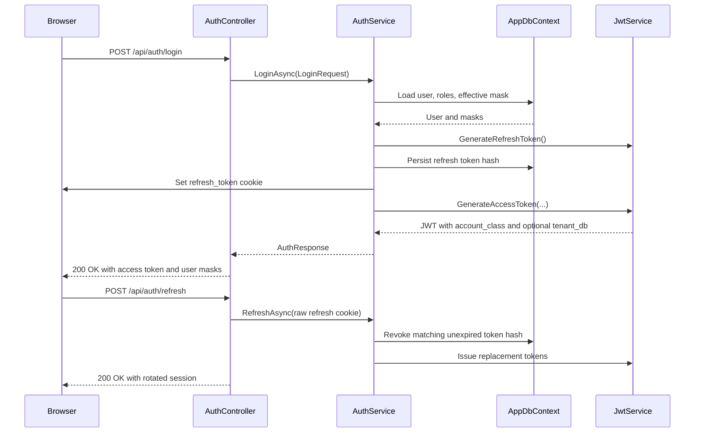

# Identity

## Purpose / Scope

Homework Central identity covers account creation, sign-in, refresh sessions,
developer persona sign-in, JWT claims, account-class scope, and tenant visibility.
The feature issues short-lived access tokens for API and SignalR authorization,
uses HttpOnly refresh cookies for browser session continuity, and carries the
account-class / tenant-database boundary used by downstream authorization.

This document covers current behavior for:

- registration and login through `api/auth`;
- refresh-token rotation and logout;
- JWT claim construction and validation;
- developer bypass login through `api/auth/dev`;
- registration captcha effects on default role assignment;
- account-class and tenant visibility rules for scoped resources.

It does not cover password reset, email verification, production tenant
selection for normal login, or frontend visual styling.

## Terminology

| Term | Meaning |
|---|---|
| Access token | Signed JWT returned in `AuthResponse.AccessToken`; used as the Bearer token for authenticated API calls and SignalR hub authorization. |
| Refresh token | Random 64-byte secret returned only as the `refresh_token` HttpOnly cookie and stored in the database as a SHA-256 hash. |
| `account_class` | JWT claim named by `TenancyConstants.AccountClassClaimName`; one of `RealAccount`, `DeveloperAccount`, or `DevAdmin`. |
| `tenant_db` | JWT claim and refresh-scope cookie named by `TenancyConstants.TenantDbClaimName`; present for developer persona sessions. |
| Effective mask | The role, moderation, feature, subject, and status masks rebuilt from role assignments and embedded in auth responses and JWT claims. |
| Developer bypass | Development-only, loopback-only login surface guarded by `HC_DEV_BYPASS` and `ASPNETCORE_ENVIRONMENT=Development`. |
| Scoped resource | Entity implementing `IScopedResource`; EF query filters and the `"ResourceVisibility"` policy enforce account-class and tenant matching. |

## Architecture

`AuthController` exposes the normal session endpoints:

| Endpoint | Current behavior |
|---|---|
| `POST /api/auth/register` | Creates a master-database user, assigns default roles based on captcha validation, returns an access token, and sets refresh cookies. |
| `POST /api/auth/login` | Verifies email and password against the master database, returns an access token, and sets refresh cookies. |
| `POST /api/auth/refresh` | Requires a valid refresh cookie and a valid Origin when an Origin header is present; rotates the refresh token and returns a new access token. |
| `POST /api/auth/logout` | Revokes the current refresh token when present, then deletes refresh-scope cookies. |
| `GET /api/auth/me` | Requires Bearer auth, resolves the current user from the token subject and optional `tenant_db` claim, and returns the current `UserDto`. |

`DevAuthController` exposes `api/auth/dev` only when
`DevBypass.IsEnabled` and `DevBypass.IsLocalhost` both pass. Otherwise the
endpoints return `404`, hiding the bypass surface from non-development callers.



### JWT access tokens

`backend/HomeworkCentral.Api/Services/JwtService.cs` signs tokens with
HMAC-SHA256 using `Jwt:Secret`. Tokens include:

- `sub`: `User.UserId`;
- `email`: `User.Email`;
- `username`: `User.Username`;
- `perm`: effective moderation mask;
- `role_mask`: effective role mask;
- `feature_mask`: effective feature mask;
- `account_class`: resolved account class;
- `jti`: per-token identifier;
- one `ClaimTypes.Role` claim per role name;
- `tenant_db` when the session belongs to a developer persona.

`backend/HomeworkCentral.Api/Program.cs` configures JWT Bearer validation for
issuer, audience, signing key, lifetime, and zero clock skew. SignalR hub calls
may pass the access token as the `access_token` query parameter for paths under
`/hubs`.

`AuthResponse.ExpiresIn` is currently `900` seconds from
`backend/HomeworkCentral.Api/Services/AuthService.cs`, while the JWT service
reads `Jwt:AccessTokenMinutes` when calculating the token expiry. Keep those
values aligned when changing token lifetime configuration.

### Refresh-token sessions

`AuthService.BuildAuthResponseAsync` creates a refresh token for every
successful register, login, dev login, and refresh. The raw token is written to
the `refresh_token` cookie. Only its SHA-256 hash is persisted in the
`RefreshTokens` table for the database that owns the session.

Refresh tokens rotate on `POST /api/auth/refresh`:

1. The `tenant_db` cookie selects the tenant database for developer persona
   sessions; absence selects the master database.
2. The raw refresh token cookie is hashed.
3. A matching, unrevoked, unexpired row is atomically marked revoked.
4. The associated user and effective mask are loaded.
5. A new refresh token row, refresh cookie, and access token are issued.

The `tenant_db` cookie selects the refresh-token store only. Authorization uses
the signed `tenant_db` claim in the access token and the account-class scope
rules in [Visibility rules](#visibility-rules).

### Refresh cookies

Refresh cookies use:

| Cookie | Purpose | Options |
|---|---|---|
| `refresh_token` | Raw refresh secret for `/api/auth/refresh` and `/api/auth/logout`. | `HttpOnly`, `SameSite=Strict`, `Secure` when the request is HTTPS, `Path=/api/auth`, expiry matching the token row. |
| `tenant_db` | Refresh-store selector for developer persona sessions. | Same options as `refresh_token`; deleted for master-database sessions. |

Refresh and logout also validate the `Origin` header when one is present.
Accepted origins must match `Cors:AllowedOrigin`. Missing Origin is allowed for
same-origin and non-browser requests.

### Account classes

| Class | Typical source | Tenant scope |
|---|---|---|
| `RealAccount` | Register / login on master | Usually no `tenant_db`; production tenant selection is not part of the current login flow. |
| `DeveloperAccount` | Dev login impersonating a persona | Persona database name, for example `tenant_math`. |
| `DevAdmin` | Dev login without persona | Master database only, with no persona `tenant_db`. |

`backend/HomeworkCentral.Api/Services/AuthService.cs` resolves session source
to account class:

| Session source | `account_class` | `tenant_db` |
|---|---|---|
| Normal register or login | `RealAccount` | Absent |
| Developer persona login | `DeveloperAccount` | Persona database name |
| DevAdmin login | `DevAdmin` | Absent |

### Visibility rules

| Viewer | Resources visible |
|---|---|
| `RealAccount` | `RealAccount` resources in the same `tenant_db` only. |
| `DeveloperAccount` | `DeveloperAccount` resources in the same `tenant_db` only. |
| `DevAdmin` | Developer-tenant resources across dev tenants; never real-account data. |

These rules are implemented in:

- `ResourceVisibilityScope` / `IAccessScopeAccessor.CanQuery`;
- `ResourceVisibilityHandler` for the ASP.NET policy `"ResourceVisibility"`;
- EF Core global query filters on entities implementing `IScopedResource`.

Shared community resources, such as chat messages, use
`IShareableScopedResource` instead of `IScopedResource` when per-tenant matching
would split a community space. The chat-specific behavior is documented in
[Chat](chat.md).

## Behavior / control flow

### Register

1. Normalize email to lowercase and trim username.
2. Reject duplicate email or username before captcha and password hashing.
3. Validate captcha for the register action.
4. Create the user with a BCrypt password hash in the master database.
5. Assign `VerifiedUser` or `Guest` based on captcha outcome.
6. Rebuild the effective mask and issue access and refresh tokens.

### Login

1. Normalize email to lowercase.
2. Load the user, roles, and effective mask from the master database.
3. Verify the password with BCrypt.
4. Rebuild missing masks when needed and issue access and refresh tokens.

### Refresh

1. Read `refresh_token` and optional `tenant_db` cookies.
2. Reject missing, expired, revoked, or unknown refresh tokens.
3. Revoke the old token before issuing the replacement.
4. Return a new access token and set replacement cookies.

### Current user

`GET /api/auth/me` reads the subject from `ClaimTypes.NameIdentifier` or `sub`,
reads `tenant_db` from the signed access token, then resolves the current user in
the corresponding database.

### Captcha registration flow

Registration calls `ICaptchaService.ValidateAsync` with `CaptchaAction.Register`
after fast duplicate email and username checks. Captcha validation consumes a
short-lived in-memory challenge and always requires an FCaptcha token. A
high-trust FCaptcha verdict can pass by itself; lower-trust verdicts must also
solve the selected in-house puzzle and pass the risk engine threshold.

| Captcha result | Default role behavior |
|---|---|
| `true` | `AssignDefaultRolesAsync` promotes the new user to `VerifiedUser`. |
| `false` | The new user receives `Guest`. |

A failed captcha does not reject registration in the current implementation.

### Developer login

Developer login has two modes:

- Selecting a developer account without a persona signs in as the seeded
  `DevAdmin` master-database account.
- Selecting a persona verifies that the chosen persona belongs to the selected
  developer catalog entry, optionally provisions the persona, opens that
  persona's tenant database, and signs in the catalog persona user.

## Code behavior

The following excerpts are from the current source and show the concrete
identity behavior enforced by the backend.

`backend/HomeworkCentral.Api/Services/AuthService.cs` creates the refresh-token
row, sets cookies, resolves the account class, and returns a JWT-backed
`AuthResponse`:

```csharp
UserEffectiveMask effectiveMask = user.EffectiveMask
    ?? await EffectiveMaskService.RebuildOnContextAsync(db, user.UserId);

(string rawToken, DateTime refreshExpires) = jwt.GenerateRefreshToken();
db.RefreshTokens.Add(new RefreshToken
{
    Id = Guid.NewGuid(),
    UserId = user.UserId,
    TokenHash = HashToken(rawToken),
    ExpiresAt = refreshExpires,
    CreatedAt = DateTime.UtcNow,
});
await db.SaveChangesAsync();

SetRefreshCookie(rawToken, refreshExpires, tenantDatabaseName);

AccountClass accountClass = ResolveAccountClass(user, tenantDatabaseName);
UserDto dto = BuildUserDto(user, effectiveMask, accountClass);
string accessToken = jwt.GenerateAccessToken(
    user, dto.Roles, effectiveMask.ToEffectiveMaskDto(), accountClass, tenantDatabaseName);
```

`backend/HomeworkCentral.Api/Services/JwtService.cs` adds the authorization
claims consumed by API controllers, SignalR hubs, and resource visibility:

```csharp
List<Claim> claims = new()
{
    new(JwtRegisteredClaimNames.Sub, user.UserId.ToString()),
    new(JwtRegisteredClaimNames.Email, user.Email),
    new("username", user.Username),
    new("perm", masks.ModerationMask),
    new("role_mask", masks.RoleMask),
    new("feature_mask", masks.FeatureMask),
    new(TenancyConstants.AccountClassClaimName, accountClass.ToString()),
    new(JwtRegisteredClaimNames.Jti, Guid.NewGuid().ToString()),
};
claims.AddRange(roles.Select(r => new Claim(ClaimTypes.Role, r)));

if (!string.IsNullOrEmpty(tenantDatabaseName))
    claims.Add(new Claim(TenancyConstants.TenantDbClaimName, tenantDatabaseName));
```

`backend/HomeworkCentral.Api/Services/AuthService.cs` maps the current session
source to `AccountClass`:

```csharp
private static AccountClass ResolveAccountClass(User user, string? tenantDatabaseName)
{
    if (string.Equals(user.Username, DevBypass.DevAdminUsername, StringComparison.Ordinal)
        && string.IsNullOrEmpty(tenantDatabaseName))
    {
        return AccountClass.DevAdmin;
    }

    if (!string.IsNullOrEmpty(tenantDatabaseName))
        return AccountClass.DeveloperAccount;

    return AccountClass.RealAccount;
}
```

`backend/HomeworkCentral.Api/Authorization/ResourceVisibilityScope.cs` is the
central authorization rule for tenant-private resources:

```csharp
public static bool CanView(AccessScope viewer, AccountClass ownerAccountClass, string? tenantDatabaseName) =>
    viewer.AccountClass switch
    {
        AccountClass.RealAccount => ownerAccountClass == AccountClass.RealAccount
            && tenantDatabaseName == viewer.TenantDatabaseName,
        AccountClass.DevAdmin => ownerAccountClass != AccountClass.RealAccount,
        AccountClass.DeveloperAccount => ownerAccountClass == AccountClass.DeveloperAccount
            && tenantDatabaseName == viewer.TenantDatabaseName,
        _ => false,
    };
```

`backend/HomeworkCentral.Api/Data/ScopedResourceQueryFilterExtensions.cs`
translates scoped-resource rules into EF Core query filters:

```csharp
modelBuilder.Entity<TEntity>().HasQueryFilter(entity =>
    context.ScopeBypassFilters
    || (context.ScopeIsAuthenticated
        && ((context.ScopeAccountClass == AccountClass.RealAccount
                && entity.OwnerAccountClass == AccountClass.RealAccount
                && entity.TenantDatabaseName == context.ScopeTenantDatabaseName)
            || (context.ScopeAccountClass == AccountClass.DevAdmin
                && entity.OwnerAccountClass != AccountClass.RealAccount)
            || (context.ScopeAccountClass == AccountClass.DeveloperAccount
                && entity.OwnerAccountClass == AccountClass.DeveloperAccount
                && entity.TenantDatabaseName == context.ScopeTenantDatabaseName))));
```

## Implementation files

| Path | Role |
|---|---|
| [backend/HomeworkCentral.Api/Controllers/AuthController.cs](../backend/HomeworkCentral.Api/Controllers/AuthController.cs) | Normal register, login, refresh, logout, and current-user HTTP endpoints. |
| [backend/HomeworkCentral.Api/Controllers/DevAuthController.cs](../backend/HomeworkCentral.Api/Controllers/DevAuthController.cs) | Localhost-only developer bypass endpoints. |
| [backend/HomeworkCentral.Api/Services/AuthService.cs](../backend/HomeworkCentral.Api/Services/AuthService.cs) | Password verification, registration, refresh-token rotation, cookie issuance, developer login, and account-class resolution. |
| [backend/HomeworkCentral.Api/Services/JwtService.cs](../backend/HomeworkCentral.Api/Services/JwtService.cs) | JWT access-token and refresh-token generation. |
| [backend/HomeworkCentral.Api/Services/IJwtService.cs](../backend/HomeworkCentral.Api/Services/IJwtService.cs) | JWT service contract. |
| [backend/HomeworkCentral.Api/Captcha/CaptchaService.cs](../backend/HomeworkCentral.Api/Captcha/CaptchaService.cs) | Captcha challenge validation for registration and role verification. |
| [backend/HomeworkCentral.Api/Data/AppDbContext.Authorization.cs](../backend/HomeworkCentral.Api/Data/AppDbContext.Authorization.cs) | Default role assignment and verified-user promotion. |
| [backend/HomeworkCentral.Api/Data/ScopedResourceQueryFilterExtensions.cs](../backend/HomeworkCentral.Api/Data/ScopedResourceQueryFilterExtensions.cs) | EF Core account-class and tenant query filters. |
| [backend/HomeworkCentral.Api/Authorization/AccessScopeAccessor.cs](../backend/HomeworkCentral.Api/Authorization/AccessScopeAccessor.cs) | Claim-to-scope resolution for request authorization and DbContext filters. |
| [backend/HomeworkCentral.Api/Authorization/ResourceVisibilityScope.cs](../backend/HomeworkCentral.Api/Authorization/ResourceVisibilityScope.cs) | Central scoped-resource visibility rules. |
| [backend/HomeworkCentral.Api/Authorization/ResourceVisibilityAuthorization.cs](../backend/HomeworkCentral.Api/Authorization/ResourceVisibilityAuthorization.cs) | ASP.NET authorization handler for scoped resources. |
| [backend/HomeworkCentral.Api/Authorization/IScopedResource.cs](../backend/HomeworkCentral.Api/Authorization/IScopedResource.cs) | Tenant-private resource marker interface. |
| [backend/HomeworkCentral.Api/Authorization/IShareableScopedResource.cs](../backend/HomeworkCentral.Api/Authorization/IShareableScopedResource.cs) | Shared community resource marker interface used by chat. |
| [backend/HomeworkCentral.Api/Tenancy/TenancyConstants.cs](../backend/HomeworkCentral.Api/Tenancy/TenancyConstants.cs) | Stable JWT claim and migration table names. |
| [backend/HomeworkCentral.Api/Program.cs](../backend/HomeworkCentral.Api/Program.cs) | JWT validation, SignalR token extraction, CORS, rate limiting, and DI registration. |
| [frontend/src/api/authApi.ts](../frontend/src/api/authApi.ts) | Frontend auth endpoint client. |
| [frontend/src/api/tokenManager.ts](../frontend/src/api/tokenManager.ts) | Session-storage access token handling and refresh coordination. |
| [frontend/src/context/AuthContext.tsx](../frontend/src/context/AuthContext.tsx) | Browser auth state, login/register/dev-login actions, and mask helper functions. |
| [frontend/src/pages/Login.tsx](../frontend/src/pages/Login.tsx) | Standard login page. |
| [frontend/src/pages/Register.tsx](../frontend/src/pages/Register.tsx) | Registration page and captcha submission. |
| [frontend/src/pages/DevLogin.tsx](../frontend/src/pages/DevLogin.tsx) | Developer bypass sign-in page. |
| [frontend/src/types/auth.ts](../frontend/src/types/auth.ts) | Auth response, user, and mask TypeScript types. |
| [frontend/src/types/devAuth.ts](../frontend/src/types/devAuth.ts) | Developer login option and request TypeScript types. |

## Trust boundaries / failure handling

### Trust boundaries

- Email, username, password, captcha answers, and FCaptcha tokens are untrusted
  request inputs.
- `Jwt:Secret` signs both access tokens and attachment download tokens; it must
  remain secret and must be long enough for HMAC-SHA256 use.
- The raw refresh token is a bearer secret protected by `HttpOnly` and
  `SameSite=Strict`. The database stores only the token hash.
- The `tenant_db` refresh cookie is not an authorization proof. It can only
  direct refresh-token lookup to a database where the matching token hash must
  already exist.
- Dev bypass endpoints require development environment, explicit bypass flag,
  and loopback caller checks.
- `account_class` and `tenant_db` claims feed resource visibility rules. Missing
  or malformed scope denies HTTP-request query filters.
- `IShareableScopedResource` is not a tenant-private marker. Tenant-private
  resources use `IScopedResource`.

### Failure handling

| Condition | Response behavior |
|---|---|
| Duplicate email or username during register | `409 Conflict` with a user-facing message. |
| Invalid login credentials | `401 Unauthorized`. |
| Missing refresh cookie | `401 Unauthorized`. |
| Invalid, expired, revoked, or wrong-database refresh token | `401 Unauthorized`. |
| Refresh or logout Origin mismatch | `403 Forbid`. |
| Missing or invalid access-token subject on `/me` | `401 Unauthorized`. |
| User missing during `/me` lookup | `404 NotFound`. |
| Dev bypass disabled or non-loopback caller | `404 NotFound`. |
| Invalid dev account or persona relationship | `401 Unauthorized` or `400 BadRequest`, depending on the failure. |
| Expired, replayed, or incorrect captcha challenge | Captcha validation returns `false`; registration continues as `Guest`. |
| HTTP request creates a scoped DbContext without a valid identity scope | Scoped resource query filters deny all rows. |

## Configuration

| Key | Purpose | Current default or behavior |
|---|---|---|
| `Jwt:Secret` | HMAC key for JWTs and attachment access tokens. | Required through configuration, environment variable, or user secrets. |
| `Jwt:Issuer` | JWT issuer. | `HomeworkCentral`. |
| `Jwt:Audience` | JWT audience. | `HomeworkCentralUsers`. |
| `Jwt:AccessTokenMinutes` | JWT expiry used by `JwtService`. | `15` in `appsettings.json`. |
| `Jwt:RefreshTokenDays` | Refresh-token expiry. | `7` in `appsettings.json`. |
| `Cors:AllowedOrigin` | Accepted Origin for refresh and logout. | `http://localhost:5173` in `appsettings.json`. |
| `FCaptcha:*` | Self-hosted FCaptcha URLs, site key, secret, and allow threshold. | Secret is required; development defaults are rejected outside Development. |
| `Risk:*` | Captcha risk thresholds and penalties. | Register uses `Risk:RegisterBaseThreshold`. |
| `HC_DEV_BYPASS` | Enables dev auth bypass when set to `1` or `true` in Development. | Disabled unless explicitly set. |
| `ASPNETCORE_ENVIRONMENT` | Determines development-only bypass behavior and startup migration behavior. | Developer bypass requires `Development`. |

`IpRateLimiting` in `appsettings.json` currently rate-limits login, register,
captcha challenge, role verification, and FCaptcha assessment endpoints.

## Related documentation

- [Chat](chat.md) — room access, shared community resource behavior, chat
  attachments, and attachment download tokens.
- [Tickets and assessment](tickets.md) — ticket portal rooms, user watches,
  assessment flows, ticket chat, and neural scoring boundaries.
- [Runtime and operations](runtime.md) — service topology choices, local Docker
  resource guidance, and ClamAV/Ollama profile costs.
- [Comment, documentation, readability, and naming standard](COMMENT_STANDARD.md)
  — durable documentation and source-comment standards.
