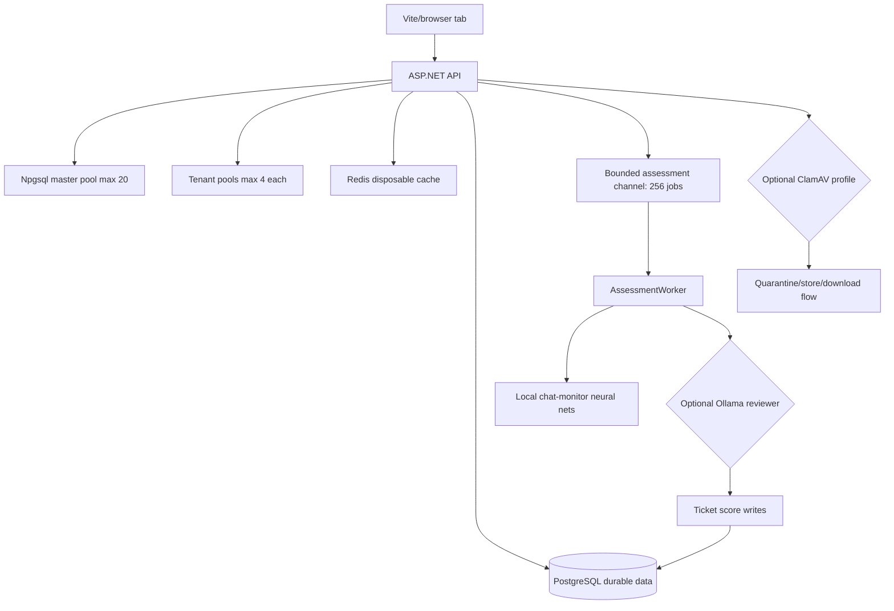
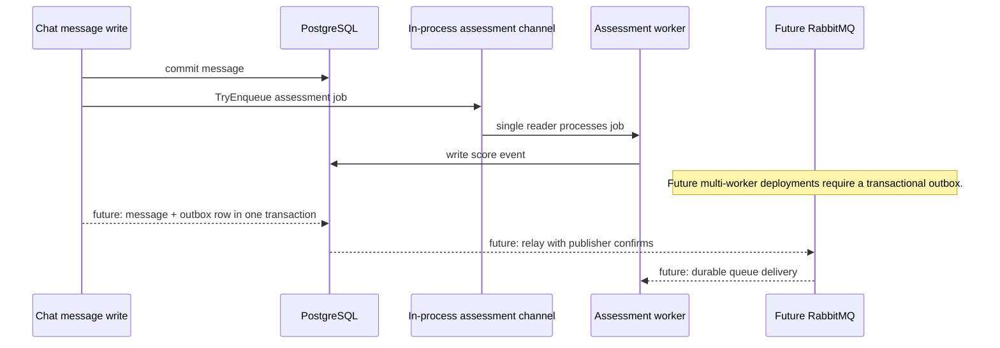

# Runtime and operations

## Purpose / Scope

Runtime behavior in Homework Central is optimized for predictable local
development on an 8 GiB Windows 11 workstation while still documenting the
service boundaries that matter in larger deployments. This document owns:

- application hot paths that reduce repeated database work and browser memory;
- bounded shared-memory choices in the backend and PostgreSQL;
- the current RabbitMQ decision and the outbox requirement for a future broker;
- ClamAV resource tradeoffs and native-service alternatives;
- Docker Compose CPU and memory profiles for the default, antivirus, and local AI
  stacks;
- WSL 2 VM caps for Windows Docker Desktop development;
- configuration and failure behavior for local runtime limits.

Feature-specific behavior remains with the feature docs:

- [docs/tickets.md](tickets.md) for ticket assessment, neural monitors, and
  Ollama scoring.
- [docs/chat.md](chat.md) for upload inspection, ClamAV scan results, room
  access, navigation behavior, and download safety.
- [docs/identity.md](identity.md) for authentication, tenant isolation, and
  rate-limit context.

## Architecture





## Current behavior

### Application hot paths

| Hot path | Current behavior |
|---|---|
| Effective masks | Memoized only within the current request or hub invocation. |
| Custom room lookup | `CustomChannelStore` atomically refreshes snapshots and uses a room-id dictionary. |
| Chat history | EF split queries load independent votes, attachments, and link previews without cartesian multiplication. |
| Attachments | Multiple attachment UUIDs load in one query before send. |
| Npgsql master pool | Capped at 20 connections with idle pruning and a bounded auto-prepare cache. |
| Tenant pools | Capped at 4 connections per tenant database. |
| Browser room state | The active room retains at most 250 messages; older history remains pageable. |

Database work in one request is batched, projected, or cached. Do not run
parallel operations on the same EF `DbContext`; use separate contexts only for
independent work that is safe to run concurrently.

### Shared memory

There are two deliberately bounded shared-memory layers:

1. The backend assessment channel is in-process, accepts up to 256 jobs, and has
   one reader.
2. PostgreSQL gets an explicit 192 MiB `/dev/shm` allocation while
   `shared_buffers` is capped at 128 MiB inside the 512 MiB container limit.

These caches and queues are accelerators, not sources of truth. PostgreSQL remains
the durable system of record. Redis is disposable cache state.

### RabbitMQ decision

RabbitMQ is not part of the default 8 GiB profile. A single backend worker already
has a bounded in-process queue; adding a broker would add an Erlang VM, another
connection pool, health checks, and several hundred MiB of working memory without
removing the need for database persistence.

RabbitMQ becomes useful when assessment workers run on multiple machines or jobs
must survive backend restarts. At that point, add a PostgreSQL transactional
outbox:

1. Write the chat message and outbox row in one transaction.
2. Relay committed outbox rows to RabbitMQ with publisher confirms.
3. Acknowledge a queue message only after the consumer commits the PostgreSQL
   result.

Adding RabbitMQ without the outbox creates a database/broker dual-write failure
window.

### ClamAV resource notes

ClamAV is the heavy service in the antivirus profile because it keeps the
signature engine in RAM. The local ClamAV image disables concurrent database
reloads, so scans pause briefly during signature reload instead of holding old and
new engines simultaneously.

An npm ClamAV package is only a client wrapper. It still needs `clamd`,
`clamdscan`, or `clamscan` plus signature data. The backend already uses the C#
`nClam` client and streams directly to `clamd`.

ClamAV can run as a native Windows service. Set `ClamAv:Host` to the Windows host
address and port `3310`. This removes the container but does not materially
reduce signature RAM; it moves that RAM outside the WSL safety cap. The Docker
antivirus profile is the safer default on the documented workstation.

PostgreSQL, Redis, and the frontend web server can also run natively, but that
mostly moves memory instead of eliminating it. Docker provides hard resource
ceilings that protect the host.

### Windows 8 GiB Docker profiles

The default `docker compose up` starts the lightweight core. Heavy services are
opt-in:

| Service | Profile | CPU ceiling | RAM ceiling | Main control |
|---|---|---:|---:|---|
| PostgreSQL | default | 1.00 | 512 MiB | smaller buffers, 50 connections, JIT disabled |
| FCaptcha | default | 0.25 | 96 MiB | small Go service |
| Redis | default | 0.25 | 96 MiB | 48 MiB LRU cache, persistence disabled |
| ASP.NET API | default | 1.00 | 512 MiB | container-aware .NET runtime limit |
| nginx frontend | default | 0.25 | 48 MiB | static production build only |
| ClamAV | `antivirus` | 0.75 | 2,560 MiB | non-concurrent signature reload, two scan workers |
| Ollama | `ai` | 1.50 | 1,536 MiB | Qwen3 0.6B, one loaded model/request |

The default core is capped at 1,264 MiB. Adding antivirus raises container
ceilings to 3,824 MiB. Adding local AI raises them to 2,800 MiB. CPU limits are
ceilings, not reservations.

Use one of these modes:

```powershell
# Core web application only
docker compose up -d

# Core plus attachment malware scanning
docker compose --profile antivirus up -d

# Core plus local AI
docker compose --profile ai up -d
```

Do not enable `antivirus` and `ai` together on an 8 GiB machine.

The Windows development launchers run Vite and the API outside Docker. Vite's V8
old-space heap defaults to 384 MiB, and the ASP.NET API's managed GC heap defaults
to 384 MiB. Override those with `NODE_OPTIONS` or `DOTNET_GCHeapHardLimit` before
launching when measurement shows the default is too low.

### WSL caps

Compose limits do not include the Linux kernel, Docker daemon, filesystem cache,
or other WSL distributions. The supplied `.wslconfig` caps the whole WSL 2 utility
VM at 4 GiB and four logical processors, with 2 GiB disk-backed swap for short
build or signature-update pressure.

```powershell
Copy-Item .\deploy\windows\.wslconfig.example $env:USERPROFILE\.wslconfig
wsl --shutdown
```

Restart Docker Desktop afterward. Sustained swapping means the active profile is
too large. The cap also applies to Ubuntu and Kali; avoid running those
distributions concurrently with a heavy Docker profile.

Microsoft documents `.wslconfig` and `autoMemoryReclaim` at
<https://learn.microsoft.com/windows/wsl/wsl-config>.

## Code behavior

### Bounded assessment queue

`backend/HomeworkCentral.Api/Assessment/AssessmentQueue.cs` uses a bounded
in-process channel with one reader and backpressure:

```csharp
private readonly Channel<AssessmentMessageJob> _channel =
    Channel.CreateBounded<AssessmentMessageJob>(new BoundedChannelOptions(256)
    {
        SingleReader = true,
        SingleWriter = false,
        FullMode = BoundedChannelFullMode.Wait,
    });

public bool TryEnqueue(AssessmentMessageJob job)
{
    bool accepted = _channel.Writer.TryWrite(job);
    if (!accepted)
        logger.LogWarning("Assessment queue is full; message {MessageId} remains unscored.", job.MessageId);
    return accepted;
}
```

### Custom channel snapshot lookup

`backend/HomeworkCentral.Api/Infrastructure/CustomChannelStore.cs` refreshes the
snapshot with one scoped query and swaps the dictionary-backed snapshot
atomically:

```csharp
public async Task RefreshAsync(CancellationToken ct = default)
{
    await using AsyncServiceScope scope = scopeFactory.CreateAsyncScope();
    AppDbContext db = scope.ServiceProvider.GetRequiredService<AppDbContext>();

    List<CustomChannel> channels = await db.CustomChannels
        .AsNoTracking()
        .Include(c => c.AccessRules)
        .Where(c => !c.IsArchived)
        .ToListAsync(ct);
```

```csharp
Dictionary<string, CustomChannelSnapshot> byRoomId = snapshots.ToDictionary(
    channel => channel.RoomId,
    StringComparer.Ordinal);
_snapshot = new StoreSnapshot(snapshots, byRoomId);
```

### Chat history split queries

`backend/HomeworkCentral.Api/Chat/ChatMessageService.cs` keeps one message-history
request bounded and avoids multiplying independent collection rows:

```csharp
int pageSize = limit is > 0 and <= 100 ? limit : DefaultPageSize;
bool isTicketRoom = await TicketRoomLookup.IsTicketChatRoomAsync(masterDb, roomId, ct);

// Real-vs-developer traffic is filtered by the IShareableScopedResource EF global query filter.
IQueryable<ChatMessage> query = masterDb.ChatMessages
    .AsNoTracking()
    .Where(message => message.RoomId == roomId);

if (beforeUtc is not null)
    query = query.Where(message => message.CreatedAtUtc < beforeUtc.Value);

if (!isTicketRoom)
    query = query.Include(m => m.Votes);

List<ChatMessage> messages = await query
    .Include(m => m.Attachments).ThenInclude(a => a.Attachment)
    .Include(m => m.LinkPreviews)
    // These are independent collections. Splitting avoids multiplying vote,
    // attachment, and preview rows in one large joined result.
    .AsSplitQuery()
    .OrderByDescending(message => message.CreatedAtUtc)
    .Take(pageSize)
    .ToListAsync(ct);
```

### Npgsql pool bounds

`backend/HomeworkCentral.Api/Tenancy/ConnectionStringHelpers.cs` bounds the master
database pool and prepared-plan cache:

```csharp
NpgsqlConnectionStringBuilder builder = new(connectionString)
{
    // PostgreSQL is capped at 50 connections. A smaller application pool avoids idle
    // connectors consuming backend and server memory on an 8 GB development host.
    MaxPoolSize = 20,
    MinPoolSize = 0,
    ConnectionIdleLifetime = 60,
    ConnectionPruningInterval = 10,
    // EF emits a small set of repeated parameterized query shapes. Auto-prepare them
    // after warmup, while bounding the per-connection plan cache.
    MaxAutoPrepare = 32,
    AutoPrepareMinUsages = 3,
    Enlist = false,
};
return builder.ConnectionString;
```

`backend/HomeworkCentral.Api/Tenancy/TenantConnectionResolver.cs` keeps per-tenant
pools small because each tenant database owns a separate Npgsql pool:

```csharp
NpgsqlConnectionStringBuilder builder = new(_baseConnectionString)
{
    Database = databaseName,
    // Each tenant database has a distinct Npgsql pool. Keep those pools tiny or dozens
    // of developer personas can retain more idle connections than PostgreSQL allows.
    MaxPoolSize = 4,
    MaxAutoPrepare = 16,
};
return builder.ConnectionString;
```

### Frontend room retention

`frontend/src/hooks/useChatRoom.ts` bounds long-lived chat tabs at 250 retained
messages:

```typescript
// Bound long-lived room tabs; older history can be fetched again through pagination.
const MAX_RETAINED_MESSAGES = 250
```

```typescript
const addMessage = useCallback((message: ChatMessage) => {
  setMessages((prev) => {
    if (prev.some((existing) => existing.messageId === message.messageId))
      return prev
    return [...prev, message].slice(-MAX_RETAINED_MESSAGES)
  })
}, [])
```

### Compose profile notes

`docker-compose.yml` makes the memory and CPU ceilings effective for ordinary
Compose runs rather than Swarm-only deployment metadata:

```yaml
postgres:
  image: postgres:16-alpine
  restart: unless-stopped
  # Local-development ceilings. Environment overrides make it possible to scale an
  # individual service without editing this file. These limits apply to ordinary
  # `docker compose up` (unlike Swarm-only deploy.resources limits).
  cpus: "${POSTGRES_CPUS:-1.0}"
  mem_limit: "${POSTGRES_MEMORY_LIMIT:-512m}"
  mem_reservation: 192m
  pids_limit: 128
  # PostgreSQL uses its own shared buffer cache plus dynamic shared-memory segments.
  # Keep /dev/shm explicit and bounded instead of Docker's small implicit default.
  shm_size: "192m"
```

ClamAV stays profile-gated and receives the largest memory ceiling:

```yaml
clamav:
  profiles: ["antivirus"]
  build:
    context: ./deploy/clamav
    dockerfile: Dockerfile
  image: homework-central-clamav:1.4-low-memory
  restart: unless-stopped
  cpus: "${CLAMAV_CPUS:-0.75}"
  # This derived image disables concurrent database reloads, so clamd briefly pauses
  # scans instead of retaining old and new signature engines simultaneously.
  mem_limit: "${CLAMAV_MEMORY_LIMIT:-2560m}"
  mem_reservation: 1536m
```

The local AI profile keeps one loaded model and one parallel request by default:

```yaml
llm:
  profiles: ["ai"]
  build:
    context: ./llm-service
    dockerfile: Dockerfile
  restart: unless-stopped
  cpus: "${LLM_CPUS:-1.5}"
  mem_limit: "${LLM_MEMORY_LIMIT:-1536m}"
  mem_reservation: 768m
  pids_limit: 256
  environment:
    LLM_CHAT_MODEL: "${LLM_CHAT_MODEL:-qwen3:0.6b}"
    # Keep CPU inference predictable on memory-constrained developer machines.
    OLLAMA_MAX_LOADED_MODELS: "${OLLAMA_MAX_LOADED_MODELS:-1}"
    OLLAMA_NUM_PARALLEL: "${OLLAMA_NUM_PARALLEL:-1}"
```

`.env.example` documents profile totals and override keys:

```dotenv
# Optional Docker resource overrides. With no profile, the five lightweight
# services are capped at about 1.25 GiB. `antivirus` raises that to about 3.75
# GiB; `ai` raises it to about 2.75 GiB. Do not enable both on an 8 GiB machine.
# POSTGRES_MEMORY_LIMIT=512m
# POSTGRES_CPUS=1.0
# FCAPTCHA_MEMORY_LIMIT=96m
# FCAPTCHA_CPUS=0.25
# REDIS_MEMORY_LIMIT=96m
# REDIS_CPUS=0.25
# CLAMAV_MEMORY_LIMIT=2560m
# CLAMAV_CPUS=0.75
# LLM_MEMORY_LIMIT=1536m
# LLM_CPUS=1.5
```

### Launcher behavior

`scripts/run-dev.sh` starts ClamAV only when explicitly opted in:

```bash
start_clamav() {
  if ! dev_clamav_opted_in; then
    log "Skipping ClamAV (set HC_ENABLE_CLAMAV=1 to scan uploads; scans fail open without it)"
    return 0
  fi
```

The same launcher bounds Vite's Node heap by default:

```bash
NODE_OPTIONS="${NODE_OPTIONS:---max-old-space-size=384}" \
  VITE_HC_DEV_BYPASS=true npm run dev --prefix "$FRONTEND_DIR" &
```

`deploy/windows/.wslconfig.example` caps the entire WSL 2 utility VM:

```ini
[wsl2]
memory=4GB
processors=4
swap=2GB

[experimental]
autoMemoryReclaim=gradual
```

## Implementation files

Primary backend runtime files:

- [backend/HomeworkCentral.Api/Program.cs](../backend/HomeworkCentral.Api/Program.cs)
- [backend/HomeworkCentral.Api/Assessment/AssessmentQueue.cs](../backend/HomeworkCentral.Api/Assessment/AssessmentQueue.cs)
- [backend/HomeworkCentral.Api/Assessment/AssessmentWorker.cs](../backend/HomeworkCentral.Api/Assessment/AssessmentWorker.cs)
- [backend/HomeworkCentral.Api/Assessment/AssessmentPipelineService.cs](../backend/HomeworkCentral.Api/Assessment/AssessmentPipelineService.cs)
- [backend/HomeworkCentral.Api/Assessment/LlmClient.cs](../backend/HomeworkCentral.Api/Assessment/LlmClient.cs)
- [backend/HomeworkCentral.Api/Infrastructure/CustomChannelStore.cs](../backend/HomeworkCentral.Api/Infrastructure/CustomChannelStore.cs)
- [backend/HomeworkCentral.Api/Chat/ChatMessageService.cs](../backend/HomeworkCentral.Api/Chat/ChatMessageService.cs)
- [backend/HomeworkCentral.Api/Tenancy/ConnectionStringHelpers.cs](../backend/HomeworkCentral.Api/Tenancy/ConnectionStringHelpers.cs)
- [backend/HomeworkCentral.Api/Tenancy/TenantConnectionResolver.cs](../backend/HomeworkCentral.Api/Tenancy/TenantConnectionResolver.cs)
- [backend/HomeworkCentral.Api/Tenancy/TenantDbContextFactory.cs](../backend/HomeworkCentral.Api/Tenancy/TenantDbContextFactory.cs)
- [backend/HomeworkCentral.Api/Uploads/ClamAvMalwareScanner.cs](../backend/HomeworkCentral.Api/Uploads/ClamAvMalwareScanner.cs)
- [backend/HomeworkCentral.Api/Uploads/ClamAvOptions.cs](../backend/HomeworkCentral.Api/Uploads/ClamAvOptions.cs)
- [backend/HomeworkCentral.Api/Tickets/TicketOptions.cs](../backend/HomeworkCentral.Api/Tickets/TicketOptions.cs)

Primary frontend runtime files:

- [frontend/src/hooks/useChatRoom.ts](../frontend/src/hooks/useChatRoom.ts)
- [frontend/src/api/chatApi.ts](../frontend/src/api/chatApi.ts)
- [frontend/frontend.Dockerfile](../frontend/frontend.Dockerfile)

Primary deployment and local tooling files:

- [docker-compose.yml](../docker-compose.yml)
- [.env.example](../.env.example)
- [backend/HomeworkCentral.Api/appsettings.json](../backend/HomeworkCentral.Api/appsettings.json)
- [backend/HomeworkCentral.Api/appsettings.Development.json](../backend/HomeworkCentral.Api/appsettings.Development.json)
- [deploy/windows/.wslconfig.example](../deploy/windows/.wslconfig.example)
- [deploy/clamav/Dockerfile](../deploy/clamav/Dockerfile)
- [llm-service/Dockerfile](../llm-service/Dockerfile)
- [scripts/run-dev.sh](../scripts/run-dev.sh)
- [scripts/run-dev.ps1](../scripts/run-dev.ps1)
- [scripts/dev-stack-lib.sh](../scripts/dev-stack-lib.sh)
- [scripts/dev-stack-lib.ps1](../scripts/dev-stack-lib.ps1)
- [scripts/start-api-dev.sh](../scripts/start-api-dev.sh)
- [scripts/start-api-dev.ps1](../scripts/start-api-dev.ps1)
- [scripts/start-frontend-dev.ps1](../scripts/start-frontend-dev.ps1)

Cluster deployment notes:

- [deploy/k8s/llm/base/configmap.yaml](../deploy/k8s/llm/base/configmap.yaml)
- [deploy/kubernetes/README.md](../deploy/kubernetes/README.md)

## Failure / config / related docs

### Failure behavior

| Condition | Behavior |
|---|---|
| Assessment channel full | `TryEnqueue` returns false and logs the unscored message id. |
| Backend restarts with in-process jobs queued | In-memory jobs are lost; durable recovery requires the future outbox/broker design. |
| PostgreSQL exceeds container memory | Container can OOM/restart; inspect `docker compose logs postgres` and `docker stats`. |
| Host exceeds WSL cap | Sustained swapping indicates the active profile is too large. |
| ClamAV disabled in dev launcher | Upload scanning records not-scanned/fail-open behavior according to the upload pipeline. |
| ClamAV signature reload | New scans can pause briefly rather than doubling signature-engine memory. |
| Ollama profile absent | Neural-only or unavailable-reviewer ticket scoring continues without live reviewer output. |
| `antivirus` and `ai` enabled together on 8 GiB host | Profile exceeds the documented safe envelope; stop one heavy profile. |
| Local PostgreSQL owns the default port | Launchers search the configured port range or direct the operator to update `.env`. |

### Configuration

| Setting | Default | Purpose |
|---|---:|---|
| `POSTGRES_MEMORY_LIMIT` | `512m` | PostgreSQL Compose memory ceiling. |
| `POSTGRES_CPUS` | `1.0` | PostgreSQL Compose CPU ceiling. |
| `POSTGRES_HOST_PORT` | `5434` | Host port for local PostgreSQL. |
| `FCAPTCHA_MEMORY_LIMIT` | `96m` | FCaptcha Compose memory ceiling. |
| `REDIS_MEMORY_LIMIT` | `96m` | Redis container ceiling. |
| `BACKEND_MEMORY_LIMIT` | `512m` | API container ceiling. |
| `FRONTEND_MEMORY_LIMIT` | `48m` | nginx frontend ceiling. |
| `CLAMAV_MEMORY_LIMIT` | `2560m` | ClamAV antivirus profile ceiling. |
| `LLM_MEMORY_LIMIT` | `1536m` | Ollama AI profile ceiling. |
| `OLLAMA_MAX_LOADED_MODELS` | `1` | Loaded-model cap in local AI profile. |
| `OLLAMA_NUM_PARALLEL` | `1` | Parallel Ollama request cap. |
| `OLLAMA_KEEP_ALIVE` | `2m` | Idle model unload window. |
| `HC_ENABLE_CLAMAV` | unset | Enables ClamAV in local dev launchers. |
| `NODE_OPTIONS` | `--max-old-space-size=384` in `run-dev.sh` | Vite Node heap limit. |
| `DOTNET_GCHeapHardLimit` | launcher default in PowerShell flow | API managed heap hard limit outside Docker. |
| WSL `memory` | `4GB` | Whole WSL 2 utility VM cap. |
| WSL `swap` | `2GB` | Disk-backed swap for brief pressure. |

### Operational commands

Measure warmed-up container use:

```powershell
docker stats --no-stream
```

Release containers while preserving data volumes:

```powershell
docker compose down
```

If Windows still reports a large WSL process after containers stop:

```powershell
wsl --shutdown
```

Only raise limits after `docker stats`, OOM-kill evidence, or service logs show a
specific ceiling is too low. Keep the active profile below roughly 3.75 GiB so
the Docker daemon and WSL kernel fit under the 4 GiB VM cap.

### Related docs

- [docs/tickets.md](tickets.md) — assessment pipeline, neural monitors, Ollama blend, and training notes
- [docs/chat.md](chat.md) — attachment scan statuses, fail behavior, room access, and navigation behavior
- [docs/identity.md](identity.md) — authentication, captcha, account-class, and tenant isolation
- [docs/README.md](README.md) — documentation index
