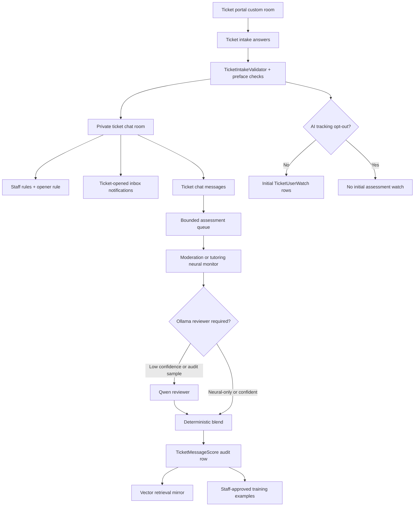
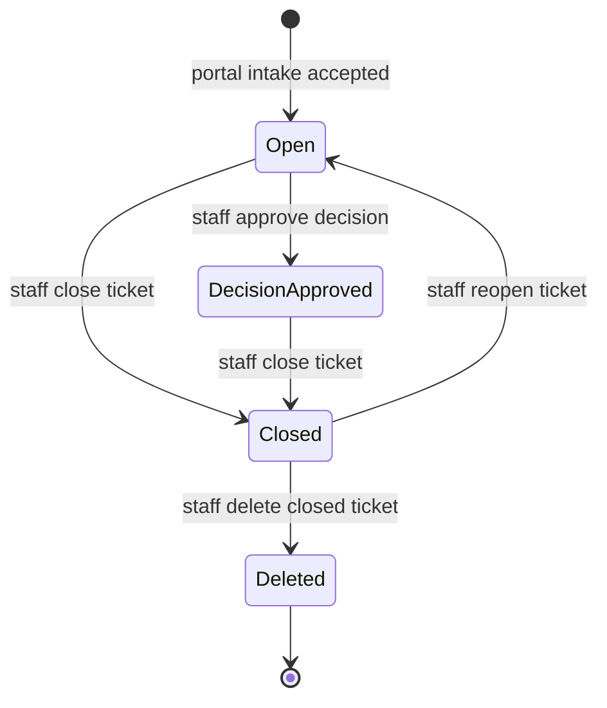
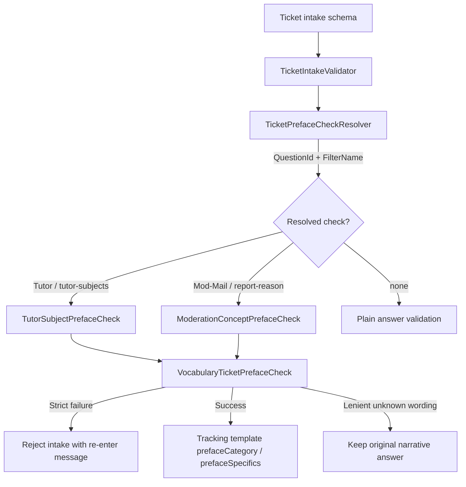
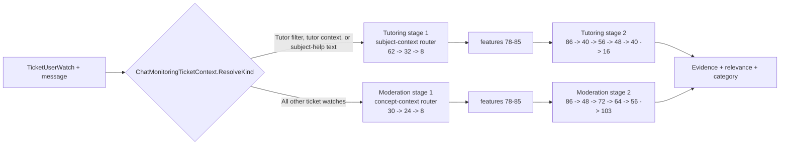
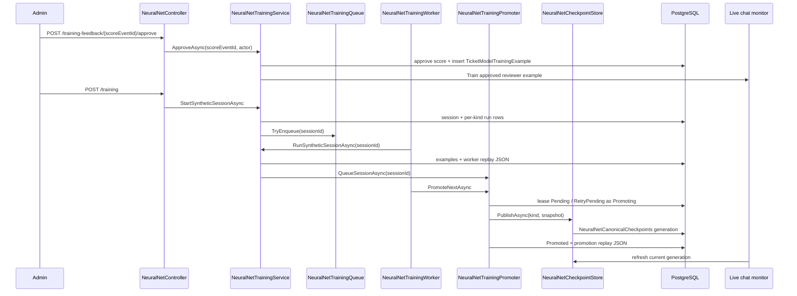

# Tickets and assessment

## Purpose / Scope

Tickets are case-specific private chat rooms opened from public ticket portals.
They cover tutor applications, moderator reports, intake files and forwarded
messages, staff inbox notifications, optional assessment watches, candidate
decisions, chat votes outside ticket rooms, and neural evidence scoring.

This document owns the feature-level behavior for:

- ticket portals and the open/close/reopen/delete lifecycle;
- default Tutor and Mod-Mail portals;
- Trial Tutor decision side effects;
- intake validation and preface checks;
- message votes in ordinary chat rooms;
- assessment ownership between deterministic application code, neural monitors,
  Ollama review, PostgreSQL, and vector retrieval;
- training examples, reviewer corrections, neural promotion, and retrieval
  archives.

Room visibility, tenant scope, and upload scanning stay with their feature docs:

- [docs/chat.md](chat.md)
- [docs/identity.md](identity.md)

## Architecture





## How to use

### Open and work a ticket

1. Sign in as a non-guest user and open a visible ticket portal room from
   `/chat/:roomId`. Seeded portals are "Apply for Tutor Positions" and
   "Notify Mods"; additional portals are custom rooms of type `Ticket`.
2. The portal panel loads room and portal metadata, then submits intake answers
   with `POST /api/channels/by-room/{portalRoomId}/tickets`.
3. The server validates answers, runs configured preface checks, creates a
   private ticket chat room, copies staff access rules, grants the opener direct
   access, creates inbox notifications, and returns the ticket DTO.
4. Staff and the opener continue the case in the private chat room. Ticket chat
   uses the chat message APIs and SignalR behavior described in
   [Chat](chat.md), while the ticket lifecycle uses the endpoints below.

The flowchart above shows portal intake, private room creation, notifications,
watch creation, and assessment queueing. The state diagram shows the open,
closed, reopened, approved-decision, and deleted lifecycle states.

### Administer portals and ticket lifecycle

- Configure ticket portals in Server Maintenance with `/server` and
  `/server/channels/{channelId}`. Portal config is read with
  `GET /api/infrastructure/channels/{channelId}/ticket-config` and saved with
  `PUT /api/infrastructure/channels/{channelId}/ticket-config`.
- Read a ticket by ID with `GET /api/tickets/{ticketId}` or from its private room
  with `GET /api/tickets/by-room/{roomId}`.
- Close, reopen, or delete with `POST /api/tickets/{ticketId}/close`,
  `POST /api/tickets/{ticketId}/reopen`, and `DELETE /api/tickets/{ticketId}`.
  Deletion is only allowed after close.
- Add or update watched users with `POST /api/tickets/{ticketId}/watches`.
- Run a manual analysis pass with `POST /api/tickets/{ticketId}/analyze`.
- Apply a human ticket decision with
  `POST /api/tickets/{ticketId}/approve-decision`. Tutor approval or trial
  decisions grant the `TrialTutor` role to the opener and remove `Tutor` when it
  is present.

### Review scoring and train neural monitors

- Ticket messages enqueue live assessment work when active watches exist and the
  intake did not opt out of tracking.
- Pending reviewer-completed score events are listed in Server Maintenance under
  `/server/NeuralNet/TrainingFeedback` and through
  `GET /api/neural-net/training-feedback`.
- Approve or reject feedback with
  `POST /api/neural-net/training-feedback/{scoreEventId}/approve` or
  `POST /api/neural-net/training-feedback/{scoreEventId}/reject`.
- Queue synthetic training from `/server/NeuralNet/Training` with
  `POST /api/neural-net/training`; list, remove, and download session reports
  with `GET /api/neural-net/training`,
  `DELETE /api/neural-net/training/{sessionId}`, and
  `GET /api/neural-net/training/{sessionId}/report?chatMonitoringKind=`.
- Inspect counts and topology with `/server/NeuralNet/DataManagement`,
  `/server/NeuralNet/Visualizer`, `GET /api/neural-net/data-management`, and
  `GET /api/neural-net/visualizer`.

### Find the implementation detail to change

- Use [Ticket portals](#ticket-portals), [Open lifecycle](#open-lifecycle), and
  [Intake validation and preface checks](#intake-validation-and-preface-checks)
  for portal and answer behavior.
- Use [Assessment ownership](#assessment-ownership) and
  [Neural monitors and Ollama blend](#neural-monitors-and-ollama-blend) before
  changing live scoring, reviewer fallback, or confidence movement.
- The [Code behavior](#code-behavior) snippets show the transaction used to open
  a ticket, private room access-rule creation, intake answer dispatch, preface
  resolution, score persistence, monitor selection, training session enqueue,
  canonical promotion, and vote rejection in ticket rooms.

### Key endpoints

| Task | API or UI |
|---|---|
| Open a portal and submit intake | `/chat/:portalRoomId`, `POST /api/channels/by-room/{portalRoomId}/tickets` |
| Configure a ticket portal | `/server/channels/{channelId}`, `GET/PUT /api/infrastructure/channels/{channelId}/ticket-config` |
| Read ticket state | `GET /api/tickets/{ticketId}`, `GET /api/tickets/by-room/{roomId}` |
| Close, reopen, or delete | `POST /api/tickets/{ticketId}/close`, `POST /api/tickets/{ticketId}/reopen`, `DELETE /api/tickets/{ticketId}` |
| Manage watches and analysis | `POST /api/tickets/{ticketId}/watches`, `POST /api/tickets/{ticketId}/analyze` |
| Approve ticket decision | `POST /api/tickets/{ticketId}/approve-decision` |
| Approve score as training data | `POST /api/tickets/{ticketId}/scores/{scoreEventId}/approve-training` |
| Review and manage neural data | `/server/NeuralNet/*`, `/api/neural-net/*` |

## Current behavior

### Ticket portals

Ticket portals are custom channels with `CustomRoomType.Ticket`. The seeded
portals live in the master database once per `AccountClass`:

| Display name | Filter name | Tracking mode | Private room title pattern |
|---|---|---|---|
| Apply for Tutor Positions | Tutor | opener | `Ticket - Tutor - 0001` |
| Notify Mods | Mod-Mail | intake tracked user | `Ticket - Mod-Mail - 0001` |

The portal `purpose` is the human label; `filterName` is the stable filter used
in room titles, candidate side effects, and tracking context.

Portal access follows chat room access rules. Guests cannot open tickets.
Opening a ticket validates intake answers, creates a private custom chat room,
copies staff access rules, adds a direct opener rule, persists the ticket, creates
initial watches unless the intake opted out, creates any candidate application,
notifies configured staff through inbox items, refreshes channel navigation, and
returns the newly mapped ticket.

### Intake validation and preface checks

Ticket intake accepts these question types:

- `shortText`
- `longText`
- `multipleChoice`
- `trueFalse`
- `checkbox`
- `date`
- `multiSelect`
- `dropdown`
- `fileUpload`
- `link`
- `messageForward`
- `mixed`

Mixed answers may contain `text`, `file`, `link`, or `forward` parts when allowed
by the question. A portal may define at most one AI opt-out question, and that
question must be `checkbox` or `trueFalse`.

Preface checks run before ticket creation and convert selected free-text answers
into structured tracking hints. The extension point is intentionally narrow:
`ITicketPrefaceCheck` describes the question binding and processing mode,
`TicketPrefaceCheckResolver` chooses the check for a question/filter pair, and
`VocabularyTicketPrefaceCheck` supplies the shared vocabulary engine used by
the built-in Tutor and Mod-Mail checks.



Built-in preface checks:

| Portal | Check | Question | Behavior |
|---|---|---|---|
| Tutor | `TutorSubjectPrefaceCheck` | `tutor-subjects` | strict; unknown subjects reject intake |
| Mod-Mail | `ModerationConceptPrefaceCheck` | `report-reason` | lenient; unknown wording remains narrative |

Strict mode (`TutorSubjectPrefaceCheck`) requires every token to resolve to a
known subject or expertise label. Successful strict checks may rewrite the stored
answer to the canonical display string, such as `Biology, Rust`.

Lenient mode (`ModerationConceptPrefaceCheck`) extracts verified moderation
concepts while preserving the reporter's original narrative. Unknown wording
therefore stays available to staff and to the reviewer prompt instead of
blocking a Mod-Mail report.

`VocabularyTicketPrefaceCheck` lowercases input, normalizes aliases such as
`biology`, `rust`, `c++`, and `.net`, adds compact aliases, applies bounded
Levenshtein spell-checking, keeps both broad categories and specific labels,
and exposes `Extract` for the moderation and tutoring cascade feature builders.
When a check returns categories or specifics, `TicketTrackingTemplateBuilder`
stores `prefaceCategory` and `prefaceSpecifics` in the frozen tracking template.

### Open lifecycle

1. A user reaches a ticket portal room.
2. The frontend loads the portal config and renders the intake wizard.
3. The backend rejects guests and users without portal room access.
4. The backend validates answers and preface checks inside a database
   transaction.
5. The portal display number advances in the same transaction.
6. A private chat channel is created with staff rules plus a direct opener rule.
7. The ticket stores intake answers and a frozen tracking template unless the
   intake opted out.
8. Initial watches are created from the opener or tracked-user intake field,
   depending on portal tracking mode.
9. Candidate application rows are created for Tutor and Mod-Mail cases.
10. Staff and the opener receive inbox notifications.
11. The custom channel store refreshes and chat navigation broadcasts the new
   private room.

Closing a ticket renames the chat room with a closed title and deactivates active
watches. Reopening restores the open title. Deletion is allowed only after close
and removes related inbox notifications, chat messages, and the private custom
channel.

### Trial Tutor

`TrialTutor` is a cosmetic, mentionable platform role using bit `20`. It is
mutually exclusive with `Tutor` and does not inherit staff permissions. A human
approval on a Tutor ticket with an `Approve` or `Trial` decision grants
`TrialTutor` to the ticket opener and removes `Tutor` when present.

### Message votes

Ordinary chat bubbles support Reddit-style up and down votes. The score is
`upvotes - downvotes`. The frontend hides the score while hover actions are
shown. Report action opens Notify Mods with sender and forwarded message context
prefilled.

Votes are intentionally unavailable in ticket rooms. Guests cannot vote, users
cannot vote on their own messages, and a user must have access to the room before
casting or toggling a vote.

### Assessment ownership

Ticket assessment is evidence support, not autonomous case resolution:

- LLM review returns structured advisory evidence only.
- Deterministic code owns evidence/relevance blending, score movement, clamping,
  audit writes, thresholds, and decisions.
- Staff approval owns final ticket decisions and training-example approval.
- PostgreSQL is authoritative for tickets, watches, score events, candidate
  applications, and training examples.
- Vector namespaces are retrieval mirrors only; vector search never updates
  running confidence.

The running confidence starts at `0.5`:

- `0` means low confidence that observed messages meet the monitoring condition.
- `0.5` means uncertain or neutral.
- `1` means high confidence that observed messages meet the condition.

Each message update applies:

```text
requested delta = (evidenceConfidence - 0.5) * 2 * relevance * max delta
current score   = clamp(previous score + requested delta, 0, 1)
```

The default maximum movement is `0.15` per message.

## Neural / ticket analysis stack

### Neural monitors and Ollama blend

The first pass uses one of two CPU hashed-MLP chat monitors. Both monitors are
two-stage cascades: stage 1 (`f`) embeds ticket context and stage 2 (`g`) scores
evidence, relevance, and category from the shared 86-float feature vector.



| Monitor | When selected | Stage-1 role | Stage-2 output head |
|---|---|---|---|
| Moderation cascade | Default for conduct, report, and filter tickets. | Concept-context router using reported moderation concept, related concept count, family one-hot values, and concept/family text matches. | Evidence, relevance, and `100` fine moderation concepts plus catch-all. |
| Tutoring cascade | Tutor application and subject-help contexts detected from filter name, watch context, tracking instructions, or frozen template text. | Subject-context router using applied subjects, channel subject, exact/related/cross-subject support, and expertise hash bins. | Evidence, relevance, and tutoring subject/competency categories. |

The stage-2 input layout is shared across both monitors:

| Feature slots | Source |
|---|---|
| `0-43` | Hashed tokens from requirement, thread context, and message text. |
| `44-47` | Community vote, effective channel relevance, thread continuity, and prior ticket score. |
| `48-51` | Applied-subject count, exact channel match, related match, and cross-subject support. |
| `52-64` | Applied general-subject multi-hot values for the 13 Mask-C subject groups. |
| `65-77` | Channel general-subject multi-hot values. |
| `78-85` | Cascade stage-1 embedding: concept context for moderation, subject context for tutoring. |

Live scoring can run without Ollama when `Tickets:NeuralOnlyScoring=true` or
`Tickets:OllamaEnabled=false`. Otherwise, student confidence below `0.75` is sent
to `qwen3:0.6b` for review, and a deterministic 10% UUID sample of higher
confidence predictions is reviewed for audit. Reviewer evidence and relevance use
the configured `ReviewerBlendWeight` default of `0.70`. If the reviewer is not
called or cannot return a valid review, bounded neural output is still recorded.

### Live scoring path vs training path

Live scoring is message-driven and follows the [Assessment pipeline](#assessment-pipeline):

1. `ChatMessageService` saves a visible message and enqueues an `AssessmentMessageJob`.
2. `AssessmentWorker` reads the bounded queue and calls `AssessmentPipelineService`.
3. `ScoreWatchWithNeuralModel` resolves the moderation or tutoring monitor, builds
   subject/concept features, predicts the student score, and optionally invokes the
   Ollama reviewer.
4. Deterministic code blends student/reviewer signals, clamps score movement, writes
   one `TicketMessageScores` audit row, and mirrors the score event to vector search.

Training is example-driven:

- staff-approved reviewer feedback creates `TicketModelTrainingExamples` with source
  `StaffApprovedReviewer`, immediately trains the matching in-memory monitor, and
  mirrors the approved example to the `ticket_training_example` vector namespace;
- synthetic administrator sessions create fictional ticket threads, train
  `Moderation`, `Tutoring`, or both cascades, persist approved synthetic examples,
  record replay JSON, and queue canonical promotion.

`TicketMessageScores` is the authoritative append-only score-event ledger. Each
row contains score-event, ticket, message, tracked-user ids, previous score,
delta, current score, evidence confidence, relevance, rationale, model version,
raw JSON, context snapshot, student fields, reviewer fields, training approval or
rejection fields, and timestamp. Database constraints bound scores to `[0, 1]`
and enforce uniqueness per ticket/message.

Student and reviewer score fields stay separate:

| Table | Field group | Meaning |
|---|---|---|
| `TicketMessageScores` | `StudentScore`, `StudentConfidence`, `StudentRelevance`, `StudentCategory`, `StudentReasoning` | Local cascade output before optional reviewer blend. |
| `TicketMessageScores` | `ReviewerInvoked`, `ReviewerScore`, `ReviewerConfidence`, `ReviewerRelevance`, `CorrectionNeeded`, `ReviewerExplanation`, `ReviewerGuidance` | Optional Ollama review result and training guidance. |
| `TicketMessageScores` | `TrainingApprovedAtUtc`, `TrainingApprovedByUserId`, `TrainingRejectedAtUtc`, `TrainingRejectedByUserId` | Staff decision on whether reviewer feedback becomes a training example. |
| `TicketModelTrainingExamples` | `TargetScore`, `TargetRelevance`, `Category`, `ChatMonitoringKind`, `Source` | Approved target used by the matching chat-monitor lineage. |

The vector store mirrors relational rows:

| Namespace | Canonical source | Purpose |
|---|---|---|
| `ticket_message_evidence` | `TicketMessageScores` | Score-event retrieval/audit mirror. |
| `ticket_training_example` | `TicketModelTrainingExamples` | Approved training-example retrieval. |

### Synthetic training sessions, queue, and worker

`NeuralNetTrainingService.StartSyntheticSessionAsync` creates one
`NeuralNetTrainingSession` and one `ChatMonitoringNeuralModelRun` per requested
monitor kind. `NeuralNetTrainingQueue` is a bounded FIFO with capacity `8`; queued
sessions can be removed before the worker claims them.

`NeuralNetTrainingWorker` reads session ids, calls `RunSyntheticSessionAsync`, and
then asks `NeuralNetTrainingPromoter` to promote the next claimable promotion.
Training sessions:

- clamp requested tickets to `1-10` and maximum passes per ticket to `1-6`;
- generate synthetic ticket scenarios concurrently;
- select matching-domain tickets plus a configured cross-domain sample;
- train mini-batches with momentum SGD and cascade chain-rule updates;
- persist examples and vector mirrors in batches;
- sample full traces while compacting routine replay frames.

### Readability exception: hashed-MLP mini-batch training

`ChatMonitoringNeuralModelHashedMlp.TrainMiniBatchWithTrace` intentionally keeps
the stage-2 forward pass, the cascade `dC/dx` hook, and the momentum update in one
training routine. Splitting those steps across helpers would make replay trace
validation harder to audit because the chain-rule handoff between the scorer and
the stage-1 routers would no longer be visible in one control-flow path. The
guardrails are the XML documentation on the method, replay JSON validation, and
`ChatMonitoringNeuralModelHashedMlpTests`.

### Replay traces, checkpoints, and canonical promotion

Worker model weights are diagnostic candidates. Canonical promotion always
replays approved examples into a fresh session-local hashed-MLP model, publishes
a checkpoint, and marks examples with the canonical generation that consumed
them.



Promotion lease states:

| State | Meaning |
|---|---|
| `Pending` | Promotion exists and has not been claimed. |
| `Promoting` | Worker holds a lease until `LeaseExpiresAtUtc`; expired leases are claimable. |
| `RetryPending` | Previous attempt failed and can be retried when no live lease exists or the lease expired. |
| `Promoted` | Checkpoint was published and examples were marked with the generation. |
| `Rejected` | Promotion failed after the configured attempts. |

`NeuralNetCanonicalCheckpoint` is keyed by `ChatMonitoringKind` and `Generation`
and stores model version, architecture version, runtime kind, base64-packed
float32 parameters, checksum, and creation time. `NeuralNetCheckpointRefreshService`
reloads singleton live monitors when another worker publishes a newer checksum.

### NeuralNetController API surface

All `api/neural-net` routes require the `ManageServerInfrastructure` policy.

| Endpoint | Service call | Behavior |
|---|---|---|
| `GET /training-feedback` | `GetPendingFeedbackAsync` | Lists up to 200 reviewer-completed score events awaiting staff approval or rejection. |
| `POST /training-feedback/{scoreEventId}/approve` | `ApproveAsync` | Creates a `StaffApprovedReviewer` training example, trains the matching live monitor, and mirrors the example to vector search. |
| `POST /training-feedback/{scoreEventId}/reject` | `RejectAsync` | Marks reviewer feedback as rejected when it has not already been approved. |
| `GET /data-management` | `GetDataManagementAsync` | Returns pending/approved/rejected counts, training/vector totals, and category counts. |
| `GET /visualizer` | `GetVisualizerAsync` | Returns model topology summaries for both cascades. |
| `POST /training` | `StartSyntheticSessionAsync` | Queues a synthetic training session and returns `202 Accepted`. |
| `GET /training` | `GetTrainingSessionsAsync` | Lists recent sessions with per-monitor run status and replay availability. |
| `DELETE /training/{sessionId}` | `RemoveSessionAsync` | Removes a queued/completed/failed session; running sessions return `409 Conflict`. |
| `GET /training/{sessionId}/report?chatMonitoringKind=` | `GetSessionReportAsync` | Downloads worker replay JSON for a monitor kind or legacy session report JSON. |

### Frontend neural administration UI

`frontend/src/pages/NeuralNet.tsx` owns the Server Maintenance neural page. The
route path selects one of four views:

| View | Admin capability |
|---|---|
| Training | Queue `Both`, `Moderation`, or `Tutoring` synthetic sessions; choose ticket count and maximum passes; remove non-running sessions; download per-monitor replay JSON. |
| Training Feedback | Approve or reject reviewer-completed score events. |
| Data Management | Inspect approved examples, vector mirrors, pending feedback, and category distribution. |
| Visualizer & Replay | Fetch cascade topology summaries, display stage-1/stage-2 shapes, import V2 replay JSON, and step through recorded frames. |

`ReplayViewer.tsx` filters replay frames by ticket, supports step/playback
controls, respects `prefers-reduced-motion`, renders recorded topology and active
parameters, and exposes the selected frame payload for inspection.
`neuralNetApi.ts` is the typed Axios boundary, and `types/neuralNet.ts`,
`types/neuralNetReplay.ts`, and `utils/neuralNetReplay.ts` define the page
contracts and replay import limits.

## Code behavior

### Opening a ticket

`backend/HomeworkCentral.Api/Tickets/TicketService.cs` performs authorization,
validation, room allocation, watch creation, inbox notification, and navigation
refresh in `OpenTicketAsync`:

```csharp
EffectiveMaskDto openerMasks = await effectiveMaskService.GetEffectiveMaskDtoAsync(openerUserId, ct);
if (MentionPermissions.IsGuest(BitMask.FromBase64(openerMasks.RoleMask, 64)))
    throw new InvalidOperationException("Guests cannot open tickets.");
if (!chatRoomAccess.CanAccessRoom(openerMasks, openerUserId, portalRoomId))
    throw new InvalidOperationException("You cannot access this ticket portal.");

await using Microsoft.EntityFrameworkCore.Storage.IDbContextTransaction transaction =
    await db.Database.BeginTransactionAsync(ct);

TicketPortalConfig portal = await db.TicketPortalConfigs
    .Include(p => p.Channel)
    .FirstOrDefaultAsync(
        p => p.Channel.RoomId == portalRoomId
             && p.Channel.RoomType == CustomRoomType.Ticket
             && !p.Channel.IsArchived,
        ct)
    ?? throw new InvalidOperationException("Ticket portal was not found.");

if (!CanViewChannelScope(portal.Channel))
    throw new InvalidOperationException("Ticket portal is not available in your account scope.");

List<TicketIntakeQuestionDto> schema = TicketJson.DeserializeIntakeSchema(portal.IntakeSchemaJson);
Dictionary<string, TicketPrefaceResult> prefaceResults =
    TicketIntakeValidator.ValidateAnswers(schema, request.Answers, prefaceChecks, filterName: portal.FilterName);
```

The same method stores the private room, frozen tracking template, watches, and
notifications before refreshing navigation:

```csharp
string purpose = portal.Purpose;
string filterName = string.IsNullOrWhiteSpace(portal.FilterName) ? purpose : portal.FilterName;
string displayName = TicketDisplayNames.Open(filterName, displayNumber);
DateTime now = DateTime.UtcNow;
bool aiOptOut = TicketIntakeValidator.IsAiOptOut(schema, request.Answers);

CustomChannel chatChannel = await CreateTicketChatChannelAsync(
    portal,
    openerUserId,
    displayName,
    now,
    ct);

Ticket ticket = new()
{
    TicketId = Guid.NewGuid(),
    PortalChannelId = portal.ChannelId,
    ChatChannelId = chatChannel.ChannelId,
    RoomId = chatChannel.RoomId,
    DisplayNumber = displayNumber,
    Purpose = purpose,
    FilterName = filterName,
    OpenedByUserId = openerUserId,
    CreatedAtUtc = now,
    IntakeAnswersJson = TicketJson.SerializeStoredAnswers(request.Answers),
    AiTrackingOptOut = aiOptOut,
    TrackingTemplateJson = aiOptOut
        ? null
        : TicketTrackingTemplateBuilder.Build(filterName, schema, request.Answers, prefaceResults),
};

db.CustomChannels.Add(chatChannel);
db.Tickets.Add(ticket);
// AI opt-out skips initial watches because watches feed automated
// assessment work; staff inbox notification still records the ticket.
if (!aiOptOut)
    await CreateInitialWatchesAsync(ticket, portal, schema, request.Answers, openerUserId, now, ct);

CreateCandidateApplicationIfNeeded(ticket, schema, request.Answers, now);

await db.SaveChangesAsync(ct);
```

### Ticket room helpers

`CreateTicketChatChannelAsync` creates the private chat channel and copies access
rules from the portal:

```csharp
private async Task<CustomChannel> CreateTicketChatChannelAsync(
    TicketPortalConfig portal,
    Guid openerUserId,
    string displayName,
    DateTime now,
    CancellationToken ct)
{
    Guid chatChannelId = Guid.NewGuid();
    CustomChannel portalChannel = portal.Channel;
    CustomChannel chatChannel = new()
    {
        ChannelId = chatChannelId,
        RoomId = CustomChannelIds.BuildRoomId(chatChannelId),
        DisplayName = displayName,
        CategoryKey = portalChannel.CategoryKey,
        CategoryDisplayName = portalChannel.CategoryDisplayName,
        RoomType = CustomRoomType.Chat,
        IsPrivate = true,
        CreatedAtUtc = now,
        UpdatedAtUtc = now,
        CreatedByUserId = openerUserId,
        OwnerAccountClass = portalChannel.OwnerAccountClass,
        TieType = ChannelTieType.None,
    };

    List<CustomChannelAccessRuleInput> staffRules =
        TicketJson.DeserializeAccessRules(portal.StaffAccessRulesJson);
    await ApplyTicketStaffAccessRulesAsync(chatChannel, staffRules, ct);
    ApplyTicketOpenerAccess(chatChannel, openerUserId);

    return chatChannel;
}
```

The opener receives a direct access rule because portal eligibility does not
automatically grant membership in a newly allocated private room:

```csharp
private void ApplyTicketOpenerAccess(CustomChannel chatChannel, Guid openerUserId)
{
    // Private ticket channels need a direct opener rule; portal eligibility
    // does not grant membership in the newly allocated chat room.
    CustomChannelAccessRule openerRule = new()
    {
        AccessRuleId = Guid.NewGuid(),
        ChannelId = chatChannel.ChannelId,
        AllowedUserId = openerUserId,
    };
    db.CustomChannelAccessRules.Add(openerRule);
    chatChannel.AccessRules.Add(openerRule);
}
```

### Intake answer switch

`backend/HomeworkCentral.Api/Tickets/TicketIntakeValidator.cs` dispatches answer
validation by the closed intake question type set:

```csharp
private static void ValidateAnswerValue(TicketIntakeQuestionDto question, JsonElement value)
{
    switch (question.Type)
    {
        case "shortText" or "longText" or "date":
            ValidateRequiredStringAnswer(question.Prompt, value);
            break;

        case "multipleChoice" or "dropdown":
            ValidateSingleOptionAnswer(question, value);
            break;

        case "link":
            ValidateLinkAnswer(question.Prompt, value);
            break;

        case "trueFalse" or "checkbox":
            ValidateBooleanAnswer(question.Prompt, value);
            break;

        case "fileUpload":
            ValidateRequiredArrayAnswer(question.Prompt, value);
            break;

        case "multiSelect":
            ValidateMultiSelectAnswer(question, value);
            break;

        case "messageForward":
            ValidateForwardSnapshot(question.Prompt, value);
            break;

        case "mixed":
            ValidateMixedAnswer(question, value);
            break;
    }

    if (question.TracksUser && !TryParseUserId(value, out _))
    {
        throw new InvalidOperationException(
            $"Answer for '{question.Prompt}' must be a valid user id.");
    }
}
```

### Preface check resolution

`backend/HomeworkCentral.Api/Tickets/Preface/TicketPrefaceCheckResolver.cs`
selects checks by question id first, then prefers a portal filter match when
one is available:

```csharp
public ITicketPrefaceCheck? Resolve(string questionId, string? filterName = null)
{
    if (string.IsNullOrWhiteSpace(questionId))
        return null;

    List<ITicketPrefaceCheck> byQuestion = _checks
        .Where(c => string.Equals(c.QuestionId, questionId, StringComparison.OrdinalIgnoreCase))
        .ToList();
    if (byQuestion.Count == 0)
        return null;

    if (!string.IsNullOrWhiteSpace(filterName))
    {
        ITicketPrefaceCheck? filterMatch = byQuestion.FirstOrDefault(c =>
            c.FilterName is not null
            && string.Equals(c.FilterName, filterName, StringComparison.OrdinalIgnoreCase));
        if (filterMatch is not null)
            return filterMatch;
    }

    // Prefer unbound (custom-portal-friendly) checks, then first registered.
    return byQuestion.FirstOrDefault(c => c.FilterName is null) ?? byQuestion[0];
}
```

`backend/HomeworkCentral.Api/Tickets/Preface/VocabularyTicketPrefaceCheck.cs`
drives strict and lenient behavior from the shared base class:

```csharp
public TicketPrefaceResult Process(string? freeText) =>
    ProcessCore(freeText, requireAllVerified: Mode == TicketPrefaceMode.Strict);

public TicketPrefaceResult ProcessStrict(string? freeText) =>
    ProcessCore(freeText, requireAllVerified: true);

public TicketPrefaceResult ProcessLenient(string? freeText) =>
    ProcessCore(freeText, requireAllVerified: false);

private TicketPrefaceResult ProcessCore(string? freeText, bool requireAllVerified)
{
    if (string.IsNullOrWhiteSpace(freeText))
    {
        return FailEmpty(requireAllVerified);
    }

    List<string> rawTokens = SplitTokens(freeText);
    if (rawTokens.Count == 0)
        return FailEmpty(requireAllVerified);

    List<TicketPrefaceTokenResult> tokenResults = [];
    List<string> categories = [];
    List<string> specifics = [];
    List<string> displayLabels = [];
    List<string> failures = [];
```

The Tutor specialization binds strictly to the seeded Tutor portal and rewrites
successful answers to canonical subject labels:

```csharp
public override string CheckId => CheckIdValue;
public override string QuestionId => QuestionIdValue;
public override string? FilterName => DefaultTicketPortalPresets.TutorFilterName;
public override TicketPrefaceMode Mode => TicketPrefaceMode.Strict;
public override bool RewriteAnswerOnSuccess => true;

protected override void RegisterVocabulary(VocabularyBuilder builder)
{
    builder.Add("mathematics", SubjectMaskNames.Mathematics, "Mathematics");
    builder.Add("math", SubjectMaskNames.Mathematics, "Mathematics");
    builder.Add("maths", SubjectMaskNames.Mathematics, "Mathematics");

    builder.Add("science", SubjectMaskNames.Science, "Science");

    builder.Add("computer science", SubjectMaskNames.ComputerScience, "Computer Science");
    builder.Add("computerscience", SubjectMaskNames.ComputerScience, "Computer Science");
    builder.Add("comp sci", SubjectMaskNames.ComputerScience, "Computer Science");
    builder.Add("compsci", SubjectMaskNames.ComputerScience, "Computer Science");
    builder.Add("cs", SubjectMaskNames.ComputerScience, "Computer Science");
    builder.Add("coding", SubjectMaskNames.ComputerScience, "Computer Science");
    builder.Add("programming", SubjectMaskNames.ComputerScience, "Computer Science");
```

### Assessment pipeline

`backend/HomeworkCentral.Api/Assessment/AssessmentPipelineService.cs` loads active
watches for the sender, scores once per ticket/message, invokes an optional
reviewer, applies deterministic confidence movement, and persists the audit row:

```csharp
private async Task ScoreActiveWatchAsync(
    TicketUserWatch watch,
    MessageScoringContext scoringContext,
    CancellationToken ct)
{
    bool alreadyScored = await HasMessageAlreadyBeenScoredAsync(watch, scoringContext.Job.MessageId, ct);
    if (alreadyScored)
        return;

    double previousScore = await LoadPreviousTicketScoreAsync(watch, scoringContext.TicketOptions, ct);
    WatchNeuralEvaluation neuralEvaluation = ScoreWatchWithNeuralModel(watch, scoringContext, previousScore);
    ReviewerEvaluationAttempt reviewerEvaluationAttempt =
        await InvokeOptionalReviewerAsync(watch, scoringContext, neuralEvaluation, ct);
    BlendedScoreInputs blendedScoreInputs = BlendReviewerSignals(
        neuralEvaluation,
        reviewerEvaluationAttempt,
        scoringContext.TicketOptions);
    TicketConfidenceUpdate confidenceUpdate = TicketConfidenceScoring.Update(
        previousScore,
        blendedScoreInputs.Evidence,
        blendedScoreInputs.Relevance,
        scoringContext.TicketOptions.MaxScoreDeltaPerMessage);
```

Reviewer invocation is gated by neural-only mode, Ollama availability, confidence
threshold, and audit sampling:

```csharp
private static bool ShouldInvokeOptionalReviewer(
    TicketOptions ticketOptions,
    double studentConfidence,
    Guid messageId)
{
    // Neural-only mode prevents Ollama reviewer calls; disabled Ollama keeps
    // scoring on the local neural model. See
    // docs/tickets.md#neural-monitors-and-ollama-blend.
    return !ticketOptions.NeuralOnlyScoring
           && ticketOptions.OllamaEnabled
           && TicketReviewPolicy.ShouldReview(
               studentConfidence,
               messageId,
               ticketOptions.StudentConfidenceThreshold,
               ticketOptions.ReviewerAuditRate);
}
```

Reviewer output remains advisory because blend weight bounds how far it can move
neural evidence:

```csharp
private static BlendedScoreInputs BlendReviewerSignals(
    WatchNeuralEvaluation neuralEvaluation,
    ReviewerEvaluationAttempt reviewerEvaluationAttempt,
    TicketOptions ticketOptions)
{
    ChatMonitoringNeuralModelPrediction prediction = neuralEvaluation.Prediction;
    TicketReviewerEvaluation? review = reviewerEvaluationAttempt.Review;

    // Reviewer output is advisory; deterministic blend weight bounds how far
    // Ollama can move neural evidence. See
    // docs/tickets.md#neural-monitors-and-ollama-blend.
    double evidence = review switch
    {
        TicketReviewerEvaluation reviewerEvaluation => TicketReviewPolicy.Blend(
            prediction.Evidence,
            reviewerEvaluation.ReviewerScore,
            ticketOptions.ReviewerBlendWeight),
        _ => prediction.Evidence,
    };
```

Score events are the durable audit record and the vector store receives a
retrieval mirror after the database write:

```csharp
private async Task PersistScoreAndVectorAsync(
    TicketUserWatch watch,
    MessageScoringContext scoringContext,
    WatchScoringResult scoringResult,
    CancellationToken ct)
{
    db.TicketMessageScores.Add(scoringResult.ScoreEvent);
    await db.SaveChangesAsync(ct);

    await vectors.UpsertAsync(
        VectorNamespaces.TicketMessageEvidence,
        scoringContext.Job.Content,
        scoringContext.MessageEmbedding,
        positionId: watch.TicketId.ToString("N"),
        canonicalRecordId: scoringResult.ScoreEvent.ScoreEventId,
```

### Neural monitor selection and topology

`backend/HomeworkCentral.Api/Assessment/ChatMonitoringNeuralModelFactory.cs`
keeps moderation and tutoring as separate singleton lineages and resolves
training mode to one or both monitors:

```csharp
public IChatMonitoringNeuralModel Get(NeuralModelKindChatMonitoring kind) => kind switch
{
    NeuralModelKindChatMonitoring.Moderation => moderation,
    NeuralModelKindChatMonitoring.Tutoring => tutoring,
    _ => throw new ArgumentOutOfRangeException(nameof(kind), kind, "Unknown chat-monitoring neural model."),
};

public IReadOnlyList<IChatMonitoringNeuralModel> Resolve(NeuralTrainingMode mode) => mode switch
{
    NeuralTrainingMode.Moderation => [moderation],
    NeuralTrainingMode.Tutoring => [tutoring],
    NeuralTrainingMode.Both => [moderation, tutoring],
    _ => throw new ArgumentOutOfRangeException(nameof(mode), mode, "Unknown neural training mode."),
};
```

`backend/HomeworkCentral.Api/Assessment/ChatMonitoringNeuralModelHashedMlp.cs`
builds the stage-2 scorer from the shared 86-feature encoder and per-monitor
hidden widths:

```csharp
protected ChatMonitoringNeuralModelHashedMlp(
    NeuralModelKindChatMonitoring kind,
    string modelVersion,
    int firstHidden,
    int secondHidden,
    int thirdHidden,
    int fourthHidden,
    IReadOnlyList<string> layerLabels,
    IReadOnlyList<string> categoryLabels,
    int seed)
{
    Kind = kind;
    ModelVersion = modelVersion;
    this.layerLabels = layerLabels.ToArray();
    this.categoryLabels = categoryLabels.ToArray();
    int outputCount = 2 + this.categoryLabels.Length;
    layerWidths = [ChatMonitoringFeatureEncoder.FeatureCount, firstHidden, secondHidden, thirdHidden, fourthHidden, outputCount];
```

`backend/HomeworkCentral.Api/Assessment/AssessmentPipelineService.cs` selects
the live monitor and creates the shared model input before reviewer blending:

```csharp
string requirement = ChatMonitoringTicketContext.BuildRequirement(watch, 4000);
string modelRequirement = $"{requirement}\nRunning ticket confidence before this message: {previousScore:F3}.";
NeuralModelKindChatMonitoring chatMonitoringKind = ChatMonitoringTicketContext.ResolveKind(watch);
IChatMonitoringNeuralModel model = chatMonitoringModels.Get(chatMonitoringKind);
SubjectSignalSnapshot subjectSignals = ResolveSubjectSignals(
    chatMonitoringKind,
    watch,
    scoringContext.Job.RoomId);
ChatMonitoringNeuralModelInput modelInput = CreateChatMonitoringModelInput(
    modelRequirement,
    scoringContext,
    previousScore,
    subjectSignals);
ChatMonitoringNeuralModelPrediction prediction = model.Predict(modelInput);
```

### Synthetic session enqueue and worker run

`backend/HomeworkCentral.Api/Assessment/NeuralNetTrainingService.cs` persists a
session and per-kind run rows before queueing bounded background work:

```csharp
NeuralNetTrainingSession session = new()
{
    SessionId = Guid.NewGuid(), StartedByUserId = actorUserId,
    RequestedTicketCount = Math.Clamp(request.TicketCount, 1, 10),
    MaxPassesPerTicket = Math.Clamp(request.MaxPassesPerTicket, 1, 6),
    Mode = request.Mode,
    Status = "Queued", CreatedAtUtc = DateTime.UtcNow,
};
db.NeuralNetTrainingSessions.Add(session);
foreach (NeuralModelKindChatMonitoring chatMonitoringKind in GetChatMonitoringKinds(request.Mode))
{
    db.ChatMonitoringNeuralModelRuns.Add(new ChatMonitoringNeuralModelRun
    {
        RunId = Guid.NewGuid(),
        SessionId = session.SessionId,
        ChatMonitoringKind = chatMonitoringKind,
        Status = "Queued",
        CreatedAtUtc = session.CreatedAtUtc,
    });
}
await db.SaveChangesAsync(ct);
if (!queue.TryEnqueue(session.SessionId))
```

The same service claims queued sessions and runs each monitor lineage for the
session:

```csharp
DateTime claimedAt = DateTime.UtcNow;
int claimed = await db.NeuralNetTrainingSessions
    .Where(x => x.SessionId == sessionId && x.Status == "Queued")
    .ExecuteUpdateAsync(setters => setters
        .SetProperty(x => x.Status, "Running")
        .SetProperty(x => x.StartedAtUtc, claimedAt), ct);
if (claimed == 0) return;
NeuralNetTrainingSession? session = await db.NeuralNetTrainingSessions.FirstOrDefaultAsync(x => x.SessionId == sessionId, ct);
if (session is null) return;
TrainingSessionTimings timings = new();
```

### Canonical promotion

`backend/HomeworkCentral.Api/Assessment/NeuralNetTrainingPromoter.cs` claims one
pending promotion at a time by lease, replays approved examples into a fresh
session-local model, and publishes the next checkpoint generation:

```csharp
DateTime now = DateTime.UtcNow;
Guid lease = Guid.NewGuid();
NeuralNetTrainingPromotion? candidate = await db.NeuralNetTrainingPromotions
    .Where(x => x.Status != "Promoted" && x.Status != "Rejected")
    .OrderBy(x => x.ChatMonitoringKind).ThenBy(x => x.PromotionSequence).FirstOrDefaultAsync(ct);
if (candidate is null || !CanClaim(candidate.Status, candidate.LeaseExpiresAtUtc, now)) return false;

int claimed = await db.NeuralNetTrainingPromotions.Where(x => x.PromotionId == candidate.PromotionId
        && (x.Status == "Pending" || (x.Status == "RetryPending" && (x.LeaseExpiresAtUtc == null || x.LeaseExpiresAtUtc < now)) || (x.Status == "Promoting" && x.LeaseExpiresAtUtc < now)))
    .ExecuteUpdateAsync(setters => setters
        .SetProperty(x => x.Status, "Promoting")
        .SetProperty(x => x.LeaseId, lease)
        .SetProperty(x => x.LeaseExpiresAtUtc, now.AddMinutes(10))
        .SetProperty(x => x.AttemptCount, x => x.AttemptCount + 1), ct);
if (claimed == 0) return false;
```

```csharp
IChatMonitoringNeuralModelTelemetry model = CreateSessionLocalModel(candidate.ChatMonitoringKind);
NeuralNetCanonicalCheckpoint? current = await checkpoints.GetCurrentAsync(candidate.ChatMonitoringKind, ct);
NeuralNetParameterSnapshot initial = current is null
    ? model.GetParameterSnapshot(null, 0)
    : new NeuralNetParameterSnapshot(current.Generation, 0, "ieee754-float32-le", "dense-base64", model.GetTopologySnapshot().Parameters.Count, current.ParametersBase64, current.Checksum);
if (current is not null) model.LoadParameterSnapshot(initial);
foreach (TicketModelTrainingExample example in examples)
{
    ChatMonitoringNeuralModelInput input = new(example.Requirement, example.ContextSnapshot ?? string.Empty,
        example.BootstrapMessage ?? string.Empty, 0, 1, 0, .5f);
    model.Train(input, new ChatMonitoringNeuralModelTargets((float)example.TargetScore, (float)example.TargetRelevance));
}
NeuralNetParameterSnapshot snapshot = model.GetParameterSnapshot(null, examples.Count);
```

### Neural frontend API

`frontend/src/api/neuralNetApi.ts` exposes the typed calls used by
`NeuralNet.tsx` and `ReplayViewer.tsx`:

```typescript
export const neuralNetApi = {
  listFeedback: () => api.get<NeuralNetTrainingFeedback[]>('/training-feedback'),
  approve: (scoreEventId: string) => api.post<NeuralNetTrainingFeedback>(`/training-feedback/${scoreEventId}/approve`),
  reject: (scoreEventId: string) => api.post(`/training-feedback/${scoreEventId}/reject`),
  getDataManagement: () => api.get<NeuralNetDataManagement>('/data-management'),
  getVisualizer: () => api.get<NeuralNetVisualizer>('/visualizer'),
  startTraining: (request: StartNeuralNetTrainingRequest) => api.post<NeuralNetTrainingSession>('/training', request),
  listTrainingSessions: () => api.get<NeuralNetTrainingSession[]>('/training'),
  removeTrainingSession: (sessionId: string) => api.delete(`/training/${sessionId}`),
  downloadTrainingReport: (sessionId: string, chatMonitoringKind?: NeuralModelKindChatMonitoring) => api.get(`/training/${sessionId}/report`, { params: chatMonitoringKind ? { chatMonitoringKind } : undefined, responseType: 'blob' }),
}
```

### Vote service

`backend/HomeworkCentral.Api/Chat/ChatMessageVoteService.cs` enforces vote
eligibility before toggling/upserting the per-user vote:

```csharp
private async Task AssertUserCanVoteOnMessageAsync(
    ChatMessage message,
    Guid userId,
    EffectiveMaskDto masks,
    CancellationToken ct)
{
    if (!chatRoomAccess.CanAccessRoom(masks, userId, message.RoomId))
        throw new InvalidOperationException("You cannot access this room.");

    if (await TicketRoomLookup.IsTicketChatRoomAsync(db, message.RoomId, ct))
        throw new InvalidOperationException("Voting is not available in ticket rooms.");

    if (message.SenderId == userId)
        throw new InvalidOperationException("You cannot vote on your own message.");
}
```

The vote DTO uses explicit counts plus the viewer's current vote state:

```csharp
private async Task<MessageVoteDto> BuildDtoAsync(ChatMessage message, Guid viewerId, CancellationToken ct)
{
    List<ChatMessageVote> votes = await db.ChatMessageVotes.AsNoTracking()
        .Where(v => v.MessageId == message.MessageId)
        .ToListAsync(ct);
    int upvoteCount = votes.Count(v => v.Value > 0);
    int downvoteCount = votes.Count(v => v.Value < 0);
    short? viewerVoteValue = votes.FirstOrDefault(v => v.UserId == viewerId)?.Value;
    string? viewerVote = viewerVoteValue switch
    {
        > 0 => "up",
        < 0 => "down",
        _ => null,
    };

    return new MessageVoteDto(
        message.MessageId,
        message.RoomId,
        upvoteCount - downvoteCount,
        upvoteCount,
        downvoteCount,
        viewerVote);
}
```

## Implementation files

### Ticket portals, lifecycle, and preface checks

| Path | Role |
|---|---|
| [backend/HomeworkCentral.Api/Tickets/TicketService.cs](../backend/HomeworkCentral.Api/Tickets/TicketService.cs) | Ticket open/close/reopen/delete, private room creation, watches, candidate side effects, inbox notifications, and navigation refresh. |
| [backend/HomeworkCentral.Api/Tickets/ITicketService.cs](../backend/HomeworkCentral.Api/Tickets/ITicketService.cs) | Ticket service contract used by controllers. |
| [backend/HomeworkCentral.Api/Tickets/TicketIntakeValidator.cs](../backend/HomeworkCentral.Api/Tickets/TicketIntakeValidator.cs) | Intake answer validation and preface invocation. |
| [backend/HomeworkCentral.Api/Tickets/TicketJson.cs](../backend/HomeworkCentral.Api/Tickets/TicketJson.cs) | Intake schema, answers, and access-rule JSON helpers. |
| [backend/HomeworkCentral.Api/Tickets/TicketPortalSeedData.cs](../backend/HomeworkCentral.Api/Tickets/TicketPortalSeedData.cs) | Seeded portal persistence. |
| [backend/HomeworkCentral.Api/Tickets/DefaultTicketPortalPresets.cs](../backend/HomeworkCentral.Api/Tickets/DefaultTicketPortalPresets.cs) | Tutor and Mod-Mail preset schema/filter definitions. |
| [backend/HomeworkCentral.Api/Tickets/TicketTrackingTemplateBuilder.cs](../backend/HomeworkCentral.Api/Tickets/TicketTrackingTemplateBuilder.cs) | Frozen watch template construction, including preface category/specifics. |
| [backend/HomeworkCentral.Api/Tickets/OllamaTicketTrackingAnalyzer.cs](../backend/HomeworkCentral.Api/Tickets/OllamaTicketTrackingAnalyzer.cs) | Optional portal tracking analyzer. |
| [backend/HomeworkCentral.Api/Tickets/Preface/ITicketPrefaceCheck.cs](../backend/HomeworkCentral.Api/Tickets/Preface/ITicketPrefaceCheck.cs) | Preface check contract, mode enum, resolver contract, and result records. |
| [backend/HomeworkCentral.Api/Tickets/Preface/TicketPrefaceCheckResolver.cs](../backend/HomeworkCentral.Api/Tickets/Preface/TicketPrefaceCheckResolver.cs) | Question/filter preface resolution. |
| [backend/HomeworkCentral.Api/Tickets/Preface/VocabularyTicketPrefaceCheck.cs](../backend/HomeworkCentral.Api/Tickets/Preface/VocabularyTicketPrefaceCheck.cs) | Shared strict/lenient vocabulary engine. |
| [backend/HomeworkCentral.Api/Tickets/Preface/TutorSubjectPrefaceCheck.cs](../backend/HomeworkCentral.Api/Tickets/Preface/TutorSubjectPrefaceCheck.cs) | Strict Tutor subject and expertise extraction. |
| [backend/HomeworkCentral.Api/Tickets/Preface/ModerationConceptPrefaceCheck.cs](../backend/HomeworkCentral.Api/Tickets/Preface/ModerationConceptPrefaceCheck.cs) | Lenient Mod-Mail moderation concept extraction. |

### Assessment, neural monitors, training, and retrieval

| Path | Role |
|---|---|
| [backend/HomeworkCentral.Api/Assessment/AssessmentQueue.cs](../backend/HomeworkCentral.Api/Assessment/AssessmentQueue.cs) | Bounded live message assessment queue. |
| [backend/HomeworkCentral.Api/Assessment/AssessmentWorker.cs](../backend/HomeworkCentral.Api/Assessment/AssessmentWorker.cs) | Background live assessment worker. |
| [backend/HomeworkCentral.Api/Assessment/AssessmentPipelineService.cs](../backend/HomeworkCentral.Api/Assessment/AssessmentPipelineService.cs) | Live scoring, optional reviewer invocation, score ledger persistence, and vector mirror writes. |
| [backend/HomeworkCentral.Api/Assessment/TicketConfidenceScoring.cs](../backend/HomeworkCentral.Api/Assessment/TicketConfidenceScoring.cs) | Deterministic confidence delta and clamp math. |
| [backend/HomeworkCentral.Api/Assessment/TicketReviewerEvaluation.cs](../backend/HomeworkCentral.Api/Assessment/TicketReviewerEvaluation.cs) | Reviewer parse and policy types. |
| [backend/HomeworkCentral.Api/Assessment/ChatMonitoringNeuralModelContracts.cs](../backend/HomeworkCentral.Api/Assessment/ChatMonitoringNeuralModelContracts.cs) | Chat-monitor model inputs, targets, predictions, traces, telemetry, and factory contracts. |
| [backend/HomeworkCentral.Api/Assessment/ChatMonitoringNeuralModelFactory.cs](../backend/HomeworkCentral.Api/Assessment/ChatMonitoringNeuralModelFactory.cs) | Moderation/tutoring model selection and training-mode resolution. |
| [backend/HomeworkCentral.Api/Assessment/ChatMonitoringNeuralModelHashedMlp.cs](../backend/HomeworkCentral.Api/Assessment/ChatMonitoringNeuralModelHashedMlp.cs) | CPU hashed-MLP scorer, cascade wrappers, SGD, telemetry, topology, and parameter snapshots. |
| [backend/HomeworkCentral.Api/Assessment/ChatMonitoringFeatureEncoder.cs](../backend/HomeworkCentral.Api/Assessment/ChatMonitoringFeatureEncoder.cs) | Shared 86-float feature encoder and vector embedding helper. |
| [backend/HomeworkCentral.Api/Assessment/ChatMonitoringTicketContext.cs](../backend/HomeworkCentral.Api/Assessment/ChatMonitoringTicketContext.cs) | Requirement construction, moderation/tutoring routing, and category index mapping. |
| [backend/HomeworkCentral.Api/Assessment/ChatMonitoringCategoryTaxonomy.cs](../backend/HomeworkCentral.Api/Assessment/ChatMonitoringCategoryTaxonomy.cs) | Moderation and tutoring category vocabularies. |
| [backend/HomeworkCentral.Api/Assessment/ChatMonitoringSubjectSignals.cs](../backend/HomeworkCentral.Api/Assessment/ChatMonitoringSubjectSignals.cs) | Tutor subject/channel relatedness and multi-hot signals. |
| [backend/HomeworkCentral.Api/Assessment/TutorSubjectTextProcessor.cs](../backend/HomeworkCentral.Api/Assessment/TutorSubjectTextProcessor.cs) | Subject extraction helper used by tutoring signals. |
| [backend/HomeworkCentral.Api/Assessment/ChatMonitoringModerationConcepts.cs](../backend/HomeworkCentral.Api/Assessment/ChatMonitoringModerationConcepts.cs) | Fine moderation concept taxonomy and relations. |
| [backend/HomeworkCentral.Api/Assessment/ChatMonitoringModerationConceptSignals.cs](../backend/HomeworkCentral.Api/Assessment/ChatMonitoringModerationConceptSignals.cs) | Moderation concept/family feature extraction. |
| [backend/HomeworkCentral.Api/Assessment/ModerationConceptContextRouter.cs](../backend/HomeworkCentral.Api/Assessment/ModerationConceptContextRouter.cs) | Moderation cascade stage-1 router. |
| [backend/HomeworkCentral.Api/Assessment/TutoringSubjectContextRouter.cs](../backend/HomeworkCentral.Api/Assessment/TutoringSubjectContextRouter.cs) | Tutoring cascade stage-1 router. |
| [backend/HomeworkCentral.Api/Assessment/NeuralNetTrainingOptions.cs](../backend/HomeworkCentral.Api/Assessment/NeuralNetTrainingOptions.cs) | Synthetic training, replay, audit, tolerance, and batching options. |
| [backend/HomeworkCentral.Api/Assessment/NeuralNetTrainingQueue.cs](../backend/HomeworkCentral.Api/Assessment/NeuralNetTrainingQueue.cs) | Bounded synthetic-session FIFO and training worker. |
| [backend/HomeworkCentral.Api/Assessment/NeuralNetTrainingService.cs](../backend/HomeworkCentral.Api/Assessment/NeuralNetTrainingService.cs) | Reviewer feedback approval, data summaries, visualizer data, synthetic sessions, replay reports, and example persistence. |
| [backend/HomeworkCentral.Api/Assessment/NeuralNetTrainingPromoter.cs](../backend/HomeworkCentral.Api/Assessment/NeuralNetTrainingPromoter.cs) | Promotion queueing, lease claiming, canonical replay, checkpoint publication, and retry/reject handling. |
| [backend/HomeworkCentral.Api/Assessment/NeuralNetCheckpointStore.cs](../backend/HomeworkCentral.Api/Assessment/NeuralNetCheckpointStore.cs) | Canonical checkpoint read/write operations. |
| [backend/HomeworkCentral.Api/Assessment/NeuralNetCheckpointRefreshService.cs](../backend/HomeworkCentral.Api/Assessment/NeuralNetCheckpointRefreshService.cs) | Live monitor refresh from published canonical checkpoints. |
| [backend/HomeworkCentral.Api/Assessment/ChatMonitoringNeuralModelWarmupService.cs](../backend/HomeworkCentral.Api/Assessment/ChatMonitoringNeuralModelWarmupService.cs) | Startup warmup and approved-example replay for live monitors. |
| [backend/HomeworkCentral.Api/Assessment/NeuralNetReplayModels.cs](../backend/HomeworkCentral.Api/Assessment/NeuralNetReplayModels.cs) | Replay DTOs for topology, frames, payloads, parameters, and promotion validation. |
| [backend/HomeworkCentral.Api/Assessment/NeuralNetReplaySerializer.cs](../backend/HomeworkCentral.Api/Assessment/NeuralNetReplaySerializer.cs) | Canonical replay JSON serialization and checksums. |
| [backend/HomeworkCentral.Api/Assessment/NeuralNetFinite.cs](../backend/HomeworkCentral.Api/Assessment/NeuralNetFinite.cs) | Finite numeric guards for traces and parameters. |
| [backend/HomeworkCentral.Api/Assessment/ChatMonitoringVectorKeys.cs](../backend/HomeworkCentral.Api/Assessment/ChatMonitoringVectorKeys.cs) | Vector lineage position ids. |
| [backend/HomeworkCentral.Api/Assessment/VectorDocumentStore.cs](../backend/HomeworkCentral.Api/Assessment/VectorDocumentStore.cs) | Retrieval mirror storage and similarity lookup. |
| [backend/HomeworkCentral.Api/Assessment/SyntheticThreadScenarioGenerator.cs](../backend/HomeworkCentral.Api/Assessment/SyntheticThreadScenarioGenerator.cs) | Synthetic ticket/thread scenario generation and fallback fixtures. |
| [backend/HomeworkCentral.Api/Assessment/SyntheticThreadScenarioModels.cs](../backend/HomeworkCentral.Api/Assessment/SyntheticThreadScenarioModels.cs) | Synthetic scenario, message, and training report models. |
| [backend/HomeworkCentral.Api/Assessment/SyntheticCommunitySignalResolver.cs](../backend/HomeworkCentral.Api/Assessment/SyntheticCommunitySignalResolver.cs) | Synthetic community vote and confidence sampling. |
| [backend/HomeworkCentral.Api/Assessment/CommunityScoreAggregator.cs](../backend/HomeworkCentral.Api/Assessment/CommunityScoreAggregator.cs) | Community signal aggregation contract implementation. |
| [backend/HomeworkCentral.Api/Assessment/ScoringReferenceSeedData.cs](../backend/HomeworkCentral.Api/Assessment/ScoringReferenceSeedData.cs) | Reference scoring seed data. |
| [backend/HomeworkCentral.Api/Assessment/LlmClient.cs](../backend/HomeworkCentral.Api/Assessment/LlmClient.cs) | Local language-model HTTP client used by reviewer and synthetic scenario paths. |
| [backend/HomeworkCentral.Api/Assessment/DeterministicScoring.cs](../backend/HomeworkCentral.Api/Assessment/DeterministicScoring.cs) | Deterministic scoring helpers. |
| [backend/HomeworkCentral.Api/Assessment/CandidateStateService.cs](../backend/HomeworkCentral.Api/Assessment/CandidateStateService.cs) | Candidate state updates related to ticket decisions. |

### Controllers, models, DTOs, and migrations

| Path | Role |
|---|---|
| [backend/HomeworkCentral.Api/Controllers/TicketsController.cs](../backend/HomeworkCentral.Api/Controllers/TicketsController.cs) | Ticket HTTP API. |
| [backend/HomeworkCentral.Api/Controllers/NeuralNetController.cs](../backend/HomeworkCentral.Api/Controllers/NeuralNetController.cs) | Neural administration HTTP API. |
| [backend/HomeworkCentral.Api/Controllers/ChatController.cs](../backend/HomeworkCentral.Api/Controllers/ChatController.cs) | Chat, attachment, vote, user search, and inbox API used by tickets and messages. |
| [backend/HomeworkCentral.Api/Controllers/InfrastructureController.cs](../backend/HomeworkCentral.Api/Controllers/InfrastructureController.cs) | Custom channel and portal administration API. |
| [backend/HomeworkCentral.Api/Data/AppDbContext.cs](../backend/HomeworkCentral.Api/Data/AppDbContext.cs) | EF sets, constraints, relationships, and indexes for ticket/neural tables. |
| [backend/HomeworkCentral.Api/Models/TicketPortalConfig.cs](../backend/HomeworkCentral.Api/Models/TicketPortalConfig.cs) | Portal configuration model. |
| [backend/HomeworkCentral.Api/Models/Ticket.cs](../backend/HomeworkCentral.Api/Models/Ticket.cs) | Ticket, watch, score ledger, training example, session, promotion, checkpoint, and run models. |
| [backend/HomeworkCentral.Api/Models/ChatMessage.cs](../backend/HomeworkCentral.Api/Models/ChatMessage.cs) | Chat message entity scored by assessment. |
| [backend/HomeworkCentral.Api/Models/ChatAttachment.cs](../backend/HomeworkCentral.Api/Models/ChatAttachment.cs) | Attachment metadata used by ticket intake/message contexts. |
| [backend/HomeworkCentral.Api/DTOs/TicketDto.cs](../backend/HomeworkCentral.Api/DTOs/TicketDto.cs) | Ticket API DTOs. |
| [backend/HomeworkCentral.Api/DTOs/NeuralNetDto.cs](../backend/HomeworkCentral.Api/DTOs/NeuralNetDto.cs) | Neural administration DTOs. |
| [backend/HomeworkCentral.Api/DTOs/ChatMessageDto.cs](../backend/HomeworkCentral.Api/DTOs/ChatMessageDto.cs) | Chat message and attachment DTOs. |
| [backend/HomeworkCentral.Api/DTOs/ChatInboxDto.cs](../backend/HomeworkCentral.Api/DTOs/ChatInboxDto.cs) | Inbox DTOs for ticket notifications. |
| [backend/HomeworkCentral.Api/Migrations/AddTickets.cs](../backend/HomeworkCentral.Api/Migrations/AddTickets.cs) | Ticket, watch, and portal tables. |
| [backend/HomeworkCentral.Api/Migrations/AddTicketsMediaAssessment.cs](../backend/HomeworkCentral.Api/Migrations/AddTicketsMediaAssessment.cs) | Ticket intake media/assessment additions. |
| [backend/HomeworkCentral.Api/Migrations/AddTicketMessageScores.cs](../backend/HomeworkCentral.Api/Migrations/AddTicketMessageScores.cs) | `TicketMessageScores` score-event ledger. |
| [backend/HomeworkCentral.Api/Migrations/AddTicketMessageContextSnapshots.cs](../backend/HomeworkCentral.Api/Migrations/AddTicketMessageContextSnapshots.cs) | Score context snapshots. |
| [backend/HomeworkCentral.Api/Migrations/AddTicketStudentReviewer.cs](../backend/HomeworkCentral.Api/Migrations/AddTicketStudentReviewer.cs) | Student/reviewer score fields and `TicketModelTrainingExamples`. |
| [backend/HomeworkCentral.Api/Migrations/AddTrainingFeedbackRejections.cs](../backend/HomeworkCentral.Api/Migrations/AddTrainingFeedbackRejections.cs) | Training rejection audit fields. |
| [backend/HomeworkCentral.Api/Migrations/AddNeuralNetTrainingMode.cs](../backend/HomeworkCentral.Api/Migrations/AddNeuralNetTrainingMode.cs) | Synthetic training mode column. |
| [backend/HomeworkCentral.Api/Migrations/AddNeuralNetTrainingSessions.cs](../backend/HomeworkCentral.Api/Migrations/AddNeuralNetTrainingSessions.cs) | Synthetic training session table and reports. |
| [backend/HomeworkCentral.Api/Migrations/20260720194500_AddNeuralNetExampleSession.cs](../backend/HomeworkCentral.Api/Migrations/20260720194500_AddNeuralNetExampleSession.cs) | Links training examples to synthetic sessions. |
| [backend/HomeworkCentral.Api/Migrations/20260720193000_AddNeuralNetPromotionLineage.cs](../backend/HomeworkCentral.Api/Migrations/20260720193000_AddNeuralNetPromotionLineage.cs) | Promotion queue and canonical checkpoint lineage. |
| [backend/HomeworkCentral.Api/Migrations/20260720201500_AddNeuralNetExamplePromotion.cs](../backend/HomeworkCentral.Api/Migrations/20260720201500_AddNeuralNetExamplePromotion.cs) | Tracks canonical generation applied to examples. |
| [backend/HomeworkCentral.Api/Migrations/20260720213000_AddChatMonitoringNeuralModelLineages.cs](../backend/HomeworkCentral.Api/Migrations/20260720213000_AddChatMonitoringNeuralModelLineages.cs) | Per-kind moderation/tutoring lineages and run rows. |

### Frontend files

| Path | Role |
|---|---|
| [frontend/src/api/ticketsApi.ts](../frontend/src/api/ticketsApi.ts) | Ticket endpoint client. |
| [frontend/src/api/chatApi.ts](../frontend/src/api/chatApi.ts) | Chat endpoint client used for forwarded messages and attachments. |
| [frontend/src/api/neuralNetApi.ts](../frontend/src/api/neuralNetApi.ts) | Neural administration endpoint client. |
| [frontend/src/types/tickets.ts](../frontend/src/types/tickets.ts) | Ticket TypeScript contracts. |
| [frontend/src/types/chat.ts](../frontend/src/types/chat.ts) | Chat, attachment, forwarded-message, vote, and mention contracts. |
| [frontend/src/types/inbox.ts](../frontend/src/types/inbox.ts) | Inbox item contracts. |
| [frontend/src/types/neuralNet.ts](../frontend/src/types/neuralNet.ts) | Neural administration DTO contracts. |
| [frontend/src/types/neuralNetReplay.ts](../frontend/src/types/neuralNetReplay.ts) | Replay import contracts. |
| [frontend/src/utils/neuralNetReplay.ts](../frontend/src/utils/neuralNetReplay.ts) | Replay schema, topology, frame, and size validation. |
| [frontend/src/pages/ChatRoom.tsx](../frontend/src/pages/ChatRoom.tsx) | Room metadata loading and chat/custom-room panel routing. |
| [frontend/src/pages/NeuralNet.tsx](../frontend/src/pages/NeuralNet.tsx) | Server Maintenance neural page. |
| [frontend/src/hooks/useChatRoom.ts](../frontend/src/hooks/useChatRoom.ts) | Message loading, SignalR connection, send, vote, and typing behavior. |
| [frontend/src/components/neuralNet/ReplayViewer.tsx](../frontend/src/components/neuralNet/ReplayViewer.tsx) | V2 replay visualization and frame inspector. |
| [frontend/src/components/tickets/TicketPortalPanel.tsx](../frontend/src/components/tickets/TicketPortalPanel.tsx) | Portal room panel. |
| [frontend/src/components/tickets/TicketIntakeWizard.tsx](../frontend/src/components/tickets/TicketIntakeWizard.tsx) | Intake question rendering and answer collection. |
| [frontend/src/components/tickets/TicketChatChrome.tsx](../frontend/src/components/tickets/TicketChatChrome.tsx) | Ticket-room chrome. |
| [frontend/src/components/tickets/TicketBuilderPanel.tsx](../frontend/src/components/tickets/TicketBuilderPanel.tsx) | Portal builder/editor. |
| [frontend/src/components/tickets/TicketIntakeSummary.tsx](../frontend/src/components/tickets/TicketIntakeSummary.tsx) | Intake answer summary. |
| [frontend/src/components/inbox/TicketInboxItem.tsx](../frontend/src/components/inbox/TicketInboxItem.tsx) | Ticket inbox notification rendering. |

### Tests

| Path | Role |
|---|---|
| [backend/HomeworkCentral.Api.Tests/Assessment/TicketTrackingTemplateBuilderTests.cs](../backend/HomeworkCentral.Api.Tests/Assessment/TicketTrackingTemplateBuilderTests.cs) | Tracking template and preface persistence behavior. |
| [backend/HomeworkCentral.Api.Tests/Assessment/TutorSubjectTextProcessorTests.cs](../backend/HomeworkCentral.Api.Tests/Assessment/TutorSubjectTextProcessorTests.cs) | Tutor subject extraction behavior. |
| [backend/HomeworkCentral.Api.Tests/Assessment/TicketPrefaceCheckTests.cs](../backend/HomeworkCentral.Api.Tests/Assessment/TicketPrefaceCheckTests.cs) | Preface strict/lenient validation behavior. |
| [backend/HomeworkCentral.Api.Tests/Assessment/TicketConfidenceScoringTests.cs](../backend/HomeworkCentral.Api.Tests/Assessment/TicketConfidenceScoringTests.cs) | Score movement math. |
| [backend/HomeworkCentral.Api.Tests/Assessment/ChatMonitoringNeuralModelHashedMlpTests.cs](../backend/HomeworkCentral.Api.Tests/Assessment/ChatMonitoringNeuralModelHashedMlpTests.cs) | Hashed-MLP training/trace behavior. |
| [backend/HomeworkCentral.Api.Tests/Chat/ChatMessageVoteServiceTests.cs](../backend/HomeworkCentral.Api.Tests/Chat/ChatMessageVoteServiceTests.cs) | Vote eligibility and toggle behavior. |

## Failure / config / related docs

### Failure behavior

| Condition | Behavior |
|---|---|
| Guest opens ticket | `OpenTicketAsync` rejects the request. |
| User lacks portal room access | Ticket open rejects before transaction work. |
| Portal room missing or archived | Ticket open throws "Ticket portal was not found." |
| Portal belongs to another account scope | Ticket open rejects the scope. |
| Required intake answer missing | `TicketIntakeValidator` rejects the answer. |
| Invalid tracked-user answer | `TicketIntakeValidator` rejects the answer. |
| AI opt-out selected | No initial watches and no tracking template are created. |
| Ticket already closed | Watch updates and analysis reject; reopen is available. |
| Delete requested for open ticket | Delete rejects; only closed tickets can be deleted. |
| Reviewer unavailable or disabled | Neural scoring continues and records bounded evidence. |
| Neural-only scoring enabled | Ollama reviewer calls are skipped. |
| Vote in ticket room | `ChatMessageVoteService` rejects the vote. |
| Duplicate concurrent first vote | Unique violation falls back to normal toggle/update logic. |

### Configuration

| Setting | Default | Purpose |
|---|---:|---|
| `Tickets:OllamaEnabled` | `true` | Enables optional reviewer analyzer and reviewer calls. |
| `Tickets:ModelName` | `qwen3:0.6b` | Reviewer chat model name. |
| `Tickets:InitialConfidenceScore` | `0.5` | Starting ticket confidence. |
| `Tickets:MaxScoreDeltaPerMessage` | `0.15` | Per-message score movement cap. |
| `Tickets:MaxMessageCharacters` | `2000` | Message text cap for reviewer prompts. |
| `Tickets:StudentConfidenceThreshold` | `0.75` | Low-confidence reviewer threshold. |
| `Tickets:ReviewerAuditRate` | `0.10` | Deterministic high-confidence audit sample rate. |
| `Tickets:ReviewerBlendWeight` | `0.70` | Reviewer blend weight when valid review exists. |
| `Tickets:NeuralOnlyScoring` | `false` | Disables live Ollama reviewer calls when true. |
| `Llm:MaxConcurrentRequests` | `2` | Caps local Ollama chat/embed concurrency. |
| `NeuralNetTraining:PersistenceBatchSize` | `50` | Batches training example and vector persistence. |
| `NeuralNetTraining:FullTraceSampleRate` | `0.02` | Samples detailed replay traces. |

`.env.example` documents the matching Docker override names:
`TICKET_AI_INITIAL_SCORE`, `TICKET_AI_MAX_DELTA`,
`TICKET_AI_MAX_MESSAGE_CHARACTERS`, `TICKET_STUDENT_CONFIDENCE_THRESHOLD`,
`TICKET_REVIEWER_AUDIT_RATE`, and `TICKET_REVIEWER_BLEND_WEIGHT`.

### Related docs

- [docs/runtime.md](runtime.md) — assessment queue, local resource limits, Ollama concurrency, and service tradeoffs
- [docs/chat.md](chat.md) — room categories, access bits, portal visibility, ticket attachments, scanning, and download safety
- [docs/identity.md](identity.md) — JWT, account class, developer login, and account-class visibility
- [docs/README.md](README.md) — documentation index
