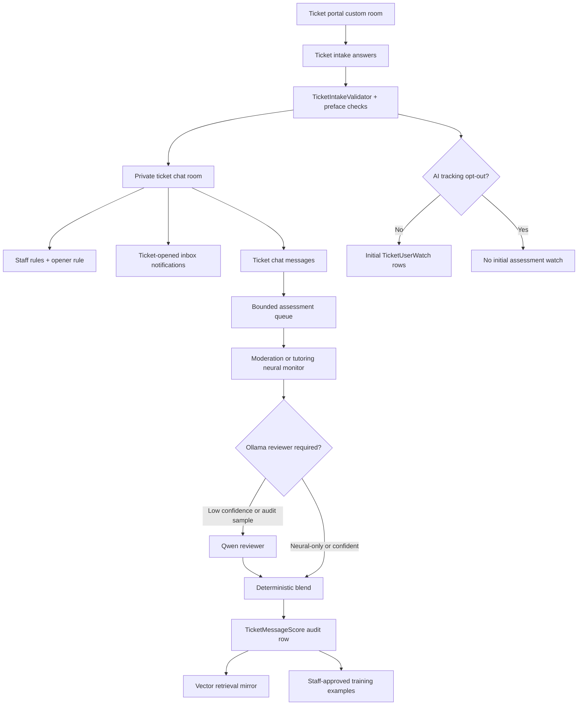
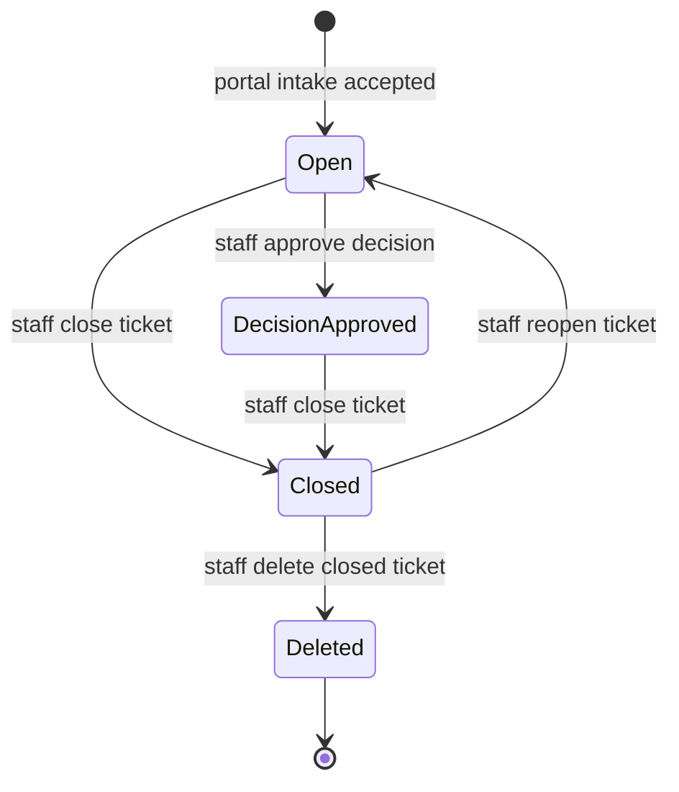

# Tickets and assessment

## Purpose / Scope

Tickets are case-specific private chat rooms opened from public ticket portals.
They cover tutor applications, moderator reports, intake files and forwarded
messages, staff inbox notifications, optional assessment watches, candidate
decisions, chat votes outside ticket rooms, and neural evidence scoring.

This document owns the feature-level behavior for:

- ticket portals and the open/close/reopen/delete lifecycle;
- default Tutor and Mod-Mail portals;
- Trial Tutor decision side effects;
- intake validation and preface checks;
- message votes in ordinary chat rooms;
- assessment ownership between deterministic application code, neural monitors,
  Ollama review, PostgreSQL, and vector retrieval;
- training examples, reviewer corrections, neural promotion, and retrieval
  archives.

Room visibility, tenant scope, and upload scanning stay with their feature docs:

- [docs/chat.md](chat.md)
- [docs/identity.md](identity.md)

## Architecture





## Current behavior

### Ticket portals

Ticket portals are custom channels with `CustomRoomType.Ticket`. The seeded
portals live in the master database once per `AccountClass`:

| Display name | Filter name | Tracking mode | Private room title pattern |
|---|---|---|---|
| Apply for Tutor Positions | Tutor | opener | `Ticket - Tutor - 0001` |
| Notify Mods | Mod-Mail | intake tracked user | `Ticket - Mod-Mail - 0001` |

The portal `purpose` is the human label; `filterName` is the stable filter used
in room titles, candidate side effects, and tracking context.

Portal access follows chat room access rules. Guests cannot open tickets.
Opening a ticket validates intake answers, creates a private custom chat room,
copies staff access rules, adds a direct opener rule, persists the ticket, creates
initial watches unless the intake opted out, creates any candidate application,
notifies configured staff through inbox items, refreshes channel navigation, and
returns the newly mapped ticket.

### Intake validation and preface checks

Ticket intake accepts these question types:

- `shortText`
- `longText`
- `multipleChoice`
- `trueFalse`
- `checkbox`
- `date`
- `multiSelect`
- `dropdown`
- `fileUpload`
- `link`
- `messageForward`
- `mixed`

Mixed answers may contain `text`, `file`, `link`, or `forward` parts when allowed
by the question. A portal may define at most one AI opt-out question, and that
question must be `checkbox` or `trueFalse`.

Preface checks are resolved by question id and filter name:

| Portal | Check | Question | Behavior |
|---|---|---|---|
| Tutor | `TutorSubjectPrefaceCheck` | `tutor-subjects` | strict; unknown subjects reject intake |
| Mod-Mail | `ModerationConceptPrefaceCheck` | `report-reason` | lenient; unknown wording remains narrative |

The vocabulary checks lowercase input, normalize aliases such as `biology` and
`rust`, retain specific labels for neural cascade input, spell-check known terms,
and store `prefaceCategory` / `prefaceSpecifics` in tracking templates when
available.

### Open lifecycle

1. A user reaches a ticket portal room.
2. The frontend loads the portal config and renders the intake wizard.
3. The backend rejects guests and users without portal room access.
4. The backend validates answers and preface checks inside a database
   transaction.
5. The portal display number advances in the same transaction.
6. A private chat channel is created with staff rules plus a direct opener rule.
7. The ticket stores intake answers and a frozen tracking template unless the
   intake opted out.
8. Initial watches are created from the opener or tracked-user intake field,
   depending on portal tracking mode.
9. Candidate application rows are created for Tutor and Mod-Mail cases.
10. Staff and the opener receive inbox notifications.
11. The custom channel store refreshes and chat navigation broadcasts the new
   private room.

Closing a ticket renames the chat room with a closed title and deactivates active
watches. Reopening restores the open title. Deletion is allowed only after close
and removes related inbox notifications, chat messages, and the private custom
channel.

### Trial Tutor

`TrialTutor` is a cosmetic, mentionable platform role using bit `20`. It is
mutually exclusive with `Tutor` and does not inherit staff permissions. A human
approval on a Tutor ticket with an `Approve` or `Trial` decision grants
`TrialTutor` to the ticket opener and removes `Tutor` when present.

### Message votes

Ordinary chat bubbles support Reddit-style up and down votes. The score is
`upvotes - downvotes`. The frontend hides the score while hover actions are
shown. Report action opens Notify Mods with sender and forwarded message context
prefilled.

Votes are intentionally unavailable in ticket rooms. Guests cannot vote, users
cannot vote on their own messages, and a user must have access to the room before
casting or toggling a vote.

### Assessment ownership

Ticket assessment is evidence support, not autonomous case resolution:

- LLM review returns structured advisory evidence only.
- Deterministic code owns evidence/relevance blending, score movement, clamping,
  audit writes, thresholds, and decisions.
- Staff approval owns final ticket decisions and training-example approval.
- PostgreSQL is authoritative for tickets, watches, score events, candidate
  applications, and training examples.
- Vector namespaces are retrieval mirrors only; vector search never updates
  running confidence.

The running confidence starts at `0.5`:

- `0` means low confidence that observed messages meet the monitoring condition.
- `0.5` means uncertain or neutral.
- `1` means high confidence that observed messages meet the condition.

Each message update applies:

```text
requested delta = (evidenceConfidence - 0.5) * 2 * relevance * max delta
current score   = clamp(previous score + requested delta, 0, 1)
```

The default maximum movement is `0.15` per message.

### Neural monitors and Ollama blend

The first pass uses one of two CPU hashed-MLP chat monitors:

| Monitor | When selected | Topology |
|---|---|---|
| Moderation cascade | default for conduct/filter tickets | stage-1 router `30 -> 24 -> 8`; stage-2 `86 -> 48 -> 72 -> 64 -> 56 -> 103` |
| Tutoring cascade | Tutor application tickets | stage-1 router `62 -> 32 -> 8`; stage-2 `86 -> 40 -> 56 -> 48 -> 40 -> 16` |

Inputs are 86 dense features: hashed text, community/prior metadata,
applied-subject multi-hot and count, channel-subject multi-hot, tutoring
relatedness, and an 8-dimensional cascade stage-1 embedding in slots 78-85.

Live scoring can run without Ollama when `Tickets:NeuralOnlyScoring=true` or
`Tickets:OllamaEnabled=false`. Otherwise, student confidence below `0.75` is sent
to `qwen3:0.6b` for review, and a deterministic 10% UUID sample of higher
confidence predictions is reviewed for audit. Reviewer evidence and relevance use
the configured `ReviewerBlendWeight` default of `0.70`. If the reviewer is not
called or cannot return a valid review, bounded neural output is still recorded.

### Vector archive and training notes

`TicketMessageScores` is the authoritative append-only score-event ledger. Each
row contains score-event, ticket, message, tracked-user ids, previous score,
delta, current score, evidence confidence, relevance, rationale, model version,
raw JSON, context snapshot, reviewer fields, and timestamp. Database constraints
bound scores to `[0, 1]` and enforce uniqueness per ticket/message.

The vector store mirrors:

| Namespace | Canonical source | Purpose |
|---|---|---|
| `ticket_message_evidence` | `TicketMessageScores` | score-event retrieval/audit mirror |
| `ticket_training_example` | `TicketModelTrainingExamples` | approved training-example retrieval |

`TicketModelTrainingExamples` stores the monitor kind (`Moderation` or
`Tutoring`), requirement, target score, target relevance, category, source,
approver, and timestamp. Live rows reference the `ChatMessages.MessageId` and
score-event UUID instead of duplicating message text. Bootstrap rows may store
inline text because they do not correspond to real messages.

Synthetic admin training can run `Both`, `Moderation`, or `Tutoring`. In `Both`
mode, each monitor has its own run, worker/promotion replay, and canonical
checkpoint lineage. Training labels are reused across epochs; persistence and
vector upserts are batched; full parameter-delta traces are sampled.

Reviewer corrections require staff approval before training. Startup rebuilds
in-memory monitor weights from approved rows for that monitor kind.

## Code behavior

### Opening a ticket

`backend/HomeworkCentral.Api/Tickets/TicketService.cs` performs authorization,
validation, room allocation, watch creation, inbox notification, and navigation
refresh in `OpenTicketAsync`:

```csharp
EffectiveMaskDto openerMasks = await effectiveMaskService.GetEffectiveMaskDtoAsync(openerUserId, ct);
if (MentionPermissions.IsGuest(BitMask.FromBase64(openerMasks.RoleMask, 64)))
    throw new InvalidOperationException("Guests cannot open tickets.");
if (!chatRoomAccess.CanAccessRoom(openerMasks, openerUserId, portalRoomId))
    throw new InvalidOperationException("You cannot access this ticket portal.");

await using Microsoft.EntityFrameworkCore.Storage.IDbContextTransaction transaction =
    await db.Database.BeginTransactionAsync(ct);

TicketPortalConfig portal = await db.TicketPortalConfigs
    .Include(p => p.Channel)
    .FirstOrDefaultAsync(
        p => p.Channel.RoomId == portalRoomId
             && p.Channel.RoomType == CustomRoomType.Ticket
             && !p.Channel.IsArchived,
        ct)
    ?? throw new InvalidOperationException("Ticket portal was not found.");

if (!CanViewChannelScope(portal.Channel))
    throw new InvalidOperationException("Ticket portal is not available in your account scope.");

List<TicketIntakeQuestionDto> schema = TicketJson.DeserializeIntakeSchema(portal.IntakeSchemaJson);
Dictionary<string, TicketPrefaceResult> prefaceResults =
    TicketIntakeValidator.ValidateAnswers(schema, request.Answers, prefaceChecks, filterName: portal.FilterName);
```

The same method stores the private room, frozen tracking template, watches, and
notifications before refreshing navigation:

```csharp
string purpose = portal.Purpose;
string filterName = string.IsNullOrWhiteSpace(portal.FilterName) ? purpose : portal.FilterName;
string displayName = TicketDisplayNames.Open(filterName, displayNumber);
DateTime now = DateTime.UtcNow;
bool aiOptOut = TicketIntakeValidator.IsAiOptOut(schema, request.Answers);

CustomChannel chatChannel = await CreateTicketChatChannelAsync(
    portal,
    openerUserId,
    displayName,
    now,
    ct);

Ticket ticket = new()
{
    TicketId = Guid.NewGuid(),
    PortalChannelId = portal.ChannelId,
    ChatChannelId = chatChannel.ChannelId,
    RoomId = chatChannel.RoomId,
    DisplayNumber = displayNumber,
    Purpose = purpose,
    FilterName = filterName,
    OpenedByUserId = openerUserId,
    CreatedAtUtc = now,
    IntakeAnswersJson = TicketJson.SerializeStoredAnswers(request.Answers),
    AiTrackingOptOut = aiOptOut,
    TrackingTemplateJson = aiOptOut
        ? null
        : TicketTrackingTemplateBuilder.Build(filterName, schema, request.Answers, prefaceResults),
};

db.CustomChannels.Add(chatChannel);
db.Tickets.Add(ticket);
// AI opt-out skips initial watches because watches feed automated
// assessment work; staff inbox notification still records the ticket.
if (!aiOptOut)
    await CreateInitialWatchesAsync(ticket, portal, schema, request.Answers, openerUserId, now, ct);

CreateCandidateApplicationIfNeeded(ticket, schema, request.Answers, now);

await db.SaveChangesAsync(ct);
```

### Ticket room helpers

`CreateTicketChatChannelAsync` creates the private chat channel and copies access
rules from the portal:

```csharp
private async Task<CustomChannel> CreateTicketChatChannelAsync(
    TicketPortalConfig portal,
    Guid openerUserId,
    string displayName,
    DateTime now,
    CancellationToken ct)
{
    Guid chatChannelId = Guid.NewGuid();
    CustomChannel portalChannel = portal.Channel;
    CustomChannel chatChannel = new()
    {
        ChannelId = chatChannelId,
        RoomId = CustomChannelIds.BuildRoomId(chatChannelId),
        DisplayName = displayName,
        CategoryKey = portalChannel.CategoryKey,
        CategoryDisplayName = portalChannel.CategoryDisplayName,
        RoomType = CustomRoomType.Chat,
        IsPrivate = true,
        CreatedAtUtc = now,
        UpdatedAtUtc = now,
        CreatedByUserId = openerUserId,
        OwnerAccountClass = portalChannel.OwnerAccountClass,
        TieType = ChannelTieType.None,
    };

    List<CustomChannelAccessRuleInput> staffRules =
        TicketJson.DeserializeAccessRules(portal.StaffAccessRulesJson);
    await ApplyTicketStaffAccessRulesAsync(chatChannel, staffRules, ct);
    ApplyTicketOpenerAccess(chatChannel, openerUserId);

    return chatChannel;
}
```

The opener receives a direct access rule because portal eligibility does not
automatically grant membership in a newly allocated private room:

```csharp
private void ApplyTicketOpenerAccess(CustomChannel chatChannel, Guid openerUserId)
{
    // Private ticket channels need a direct opener rule; portal eligibility
    // does not grant membership in the newly allocated chat room.
    CustomChannelAccessRule openerRule = new()
    {
        AccessRuleId = Guid.NewGuid(),
        ChannelId = chatChannel.ChannelId,
        AllowedUserId = openerUserId,
    };
    db.CustomChannelAccessRules.Add(openerRule);
    chatChannel.AccessRules.Add(openerRule);
}
```

### Intake answer switch

`backend/HomeworkCentral.Api/Tickets/TicketIntakeValidator.cs` dispatches answer
validation by the closed intake question type set:

```csharp
private static void ValidateAnswerValue(TicketIntakeQuestionDto question, JsonElement value)
{
    switch (question.Type)
    {
        case "shortText" or "longText" or "date":
            ValidateRequiredStringAnswer(question.Prompt, value);
            break;

        case "multipleChoice" or "dropdown":
            ValidateSingleOptionAnswer(question, value);
            break;

        case "link":
            ValidateLinkAnswer(question.Prompt, value);
            break;

        case "trueFalse" or "checkbox":
            ValidateBooleanAnswer(question.Prompt, value);
            break;

        case "fileUpload":
            ValidateRequiredArrayAnswer(question.Prompt, value);
            break;

        case "multiSelect":
            ValidateMultiSelectAnswer(question, value);
            break;

        case "messageForward":
            ValidateForwardSnapshot(question.Prompt, value);
            break;

        case "mixed":
            ValidateMixedAnswer(question, value);
            break;
    }

    if (question.TracksUser && !TryParseUserId(value, out _))
    {
        throw new InvalidOperationException(
            $"Answer for '{question.Prompt}' must be a valid user id.");
    }
}
```

### Assessment pipeline

`backend/HomeworkCentral.Api/Assessment/AssessmentPipelineService.cs` loads active
watches for the sender, scores once per ticket/message, invokes an optional
reviewer, applies deterministic confidence movement, and persists the audit row:

```csharp
private async Task ScoreActiveWatchAsync(
    TicketUserWatch watch,
    MessageScoringContext scoringContext,
    CancellationToken ct)
{
    bool alreadyScored = await HasMessageAlreadyBeenScoredAsync(watch, scoringContext.Job.MessageId, ct);
    if (alreadyScored)
        return;

    double previousScore = await LoadPreviousTicketScoreAsync(watch, scoringContext.TicketOptions, ct);
    WatchNeuralEvaluation neuralEvaluation = ScoreWatchWithNeuralModel(watch, scoringContext, previousScore);
    ReviewerEvaluationAttempt reviewerEvaluationAttempt =
        await InvokeOptionalReviewerAsync(watch, scoringContext, neuralEvaluation, ct);
    BlendedScoreInputs blendedScoreInputs = BlendReviewerSignals(
        neuralEvaluation,
        reviewerEvaluationAttempt,
        scoringContext.TicketOptions);
    TicketConfidenceUpdate confidenceUpdate = TicketConfidenceScoring.Update(
        previousScore,
        blendedScoreInputs.Evidence,
        blendedScoreInputs.Relevance,
        scoringContext.TicketOptions.MaxScoreDeltaPerMessage);
```

Reviewer invocation is gated by neural-only mode, Ollama availability, confidence
threshold, and audit sampling:

```csharp
private static bool ShouldInvokeOptionalReviewer(
    TicketOptions ticketOptions,
    double studentConfidence,
    Guid messageId)
{
    // Neural-only mode prevents Ollama reviewer calls; disabled Ollama keeps
    // scoring on the local neural model. See
    // docs/tickets.md#neural-monitors-and-ollama-blend.
    return !ticketOptions.NeuralOnlyScoring
           && ticketOptions.OllamaEnabled
           && TicketReviewPolicy.ShouldReview(
               studentConfidence,
               messageId,
               ticketOptions.StudentConfidenceThreshold,
               ticketOptions.ReviewerAuditRate);
}
```

Reviewer output remains advisory because blend weight bounds how far it can move
neural evidence:

```csharp
private static BlendedScoreInputs BlendReviewerSignals(
    WatchNeuralEvaluation neuralEvaluation,
    ReviewerEvaluationAttempt reviewerEvaluationAttempt,
    TicketOptions ticketOptions)
{
    ChatMonitoringNeuralModelPrediction prediction = neuralEvaluation.Prediction;
    TicketReviewerEvaluation? review = reviewerEvaluationAttempt.Review;

    // Reviewer output is advisory; deterministic blend weight bounds how far
    // Ollama can move neural evidence. See
    // docs/tickets.md#neural-monitors-and-ollama-blend.
    double evidence = review switch
    {
        TicketReviewerEvaluation reviewerEvaluation => TicketReviewPolicy.Blend(
            prediction.Evidence,
            reviewerEvaluation.ReviewerScore,
            ticketOptions.ReviewerBlendWeight),
        _ => prediction.Evidence,
    };
```

Score events are the durable audit record and the vector store receives a
retrieval mirror after the database write:

```csharp
private async Task PersistScoreAndVectorAsync(
    TicketUserWatch watch,
    MessageScoringContext scoringContext,
    WatchScoringResult scoringResult,
    CancellationToken ct)
{
    db.TicketMessageScores.Add(scoringResult.ScoreEvent);
    await db.SaveChangesAsync(ct);

    await vectors.UpsertAsync(
        VectorNamespaces.TicketMessageEvidence,
        scoringContext.Job.Content,
        scoringContext.MessageEmbedding,
        positionId: watch.TicketId.ToString("N"),
        canonicalRecordId: scoringResult.ScoreEvent.ScoreEventId,
```

### Vote service

`backend/HomeworkCentral.Api/Chat/ChatMessageVoteService.cs` enforces vote
eligibility before toggling/upserting the per-user vote:

```csharp
private async Task AssertUserCanVoteOnMessageAsync(
    ChatMessage message,
    Guid userId,
    EffectiveMaskDto masks,
    CancellationToken ct)
{
    if (!chatRoomAccess.CanAccessRoom(masks, userId, message.RoomId))
        throw new InvalidOperationException("You cannot access this room.");

    if (await TicketRoomLookup.IsTicketChatRoomAsync(db, message.RoomId, ct))
        throw new InvalidOperationException("Voting is not available in ticket rooms.");

    if (message.SenderId == userId)
        throw new InvalidOperationException("You cannot vote on your own message.");
}
```

The vote DTO uses explicit counts plus the viewer's current vote state:

```csharp
private async Task<MessageVoteDto> BuildDtoAsync(ChatMessage message, Guid viewerId, CancellationToken ct)
{
    List<ChatMessageVote> votes = await db.ChatMessageVotes.AsNoTracking()
        .Where(v => v.MessageId == message.MessageId)
        .ToListAsync(ct);
    int upvoteCount = votes.Count(v => v.Value > 0);
    int downvoteCount = votes.Count(v => v.Value < 0);
    short? viewerVoteValue = votes.FirstOrDefault(v => v.UserId == viewerId)?.Value;
    string? viewerVote = viewerVoteValue switch
    {
        > 0 => "up",
        < 0 => "down",
        _ => null,
    };

    return new MessageVoteDto(
        message.MessageId,
        message.RoomId,
        upvoteCount - downvoteCount,
        upvoteCount,
        downvoteCount,
        viewerVote);
}
```

## Implementation files

Primary backend files:

- [backend/HomeworkCentral.Api/Tickets/TicketService.cs](../backend/HomeworkCentral.Api/Tickets/TicketService.cs)
- [backend/HomeworkCentral.Api/Tickets/ITicketService.cs](../backend/HomeworkCentral.Api/Tickets/ITicketService.cs)
- [backend/HomeworkCentral.Api/Tickets/TicketIntakeValidator.cs](../backend/HomeworkCentral.Api/Tickets/TicketIntakeValidator.cs)
- [backend/HomeworkCentral.Api/Tickets/TicketJson.cs](../backend/HomeworkCentral.Api/Tickets/TicketJson.cs)
- [backend/HomeworkCentral.Api/Tickets/TicketPortalSeedData.cs](../backend/HomeworkCentral.Api/Tickets/TicketPortalSeedData.cs)
- [backend/HomeworkCentral.Api/Tickets/DefaultTicketPortalPresets.cs](../backend/HomeworkCentral.Api/Tickets/DefaultTicketPortalPresets.cs)
- [backend/HomeworkCentral.Api/Tickets/TicketTrackingTemplateBuilder.cs](../backend/HomeworkCentral.Api/Tickets/TicketTrackingTemplateBuilder.cs)
- [backend/HomeworkCentral.Api/Tickets/OllamaTicketTrackingAnalyzer.cs](../backend/HomeworkCentral.Api/Tickets/OllamaTicketTrackingAnalyzer.cs)
- [backend/HomeworkCentral.Api/Tickets/Preface/TutorSubjectPrefaceCheck.cs](../backend/HomeworkCentral.Api/Tickets/Preface/TutorSubjectPrefaceCheck.cs)
- [backend/HomeworkCentral.Api/Tickets/Preface/ModerationConceptPrefaceCheck.cs](../backend/HomeworkCentral.Api/Tickets/Preface/ModerationConceptPrefaceCheck.cs)
- [backend/HomeworkCentral.Api/Assessment/AssessmentPipelineService.cs](../backend/HomeworkCentral.Api/Assessment/AssessmentPipelineService.cs)
- [backend/HomeworkCentral.Api/Assessment/AssessmentQueue.cs](../backend/HomeworkCentral.Api/Assessment/AssessmentQueue.cs)
- [backend/HomeworkCentral.Api/Assessment/ChatMonitoringTicketContext.cs](../backend/HomeworkCentral.Api/Assessment/ChatMonitoringTicketContext.cs)
- [backend/HomeworkCentral.Api/Assessment/ChatMonitoringSubjectSignals.cs](../backend/HomeworkCentral.Api/Assessment/ChatMonitoringSubjectSignals.cs)
- [backend/HomeworkCentral.Api/Assessment/NeuralNetTrainingService.cs](../backend/HomeworkCentral.Api/Assessment/NeuralNetTrainingService.cs)
- [backend/HomeworkCentral.Api/Assessment/VectorDocumentStore.cs](../backend/HomeworkCentral.Api/Assessment/VectorDocumentStore.cs)
- [backend/HomeworkCentral.Api/Chat/ChatMessageVoteService.cs](../backend/HomeworkCentral.Api/Chat/ChatMessageVoteService.cs)
- [backend/HomeworkCentral.Api/Controllers/TicketsController.cs](../backend/HomeworkCentral.Api/Controllers/TicketsController.cs)
- [backend/HomeworkCentral.Api/Controllers/ChatController.cs](../backend/HomeworkCentral.Api/Controllers/ChatController.cs)
- [backend/HomeworkCentral.Api/Controllers/InfrastructureController.cs](../backend/HomeworkCentral.Api/Controllers/InfrastructureController.cs)
- [backend/HomeworkCentral.Api/Data/AppDbContext.cs](../backend/HomeworkCentral.Api/Data/AppDbContext.cs)

Primary model, DTO, and migration files:

- [backend/HomeworkCentral.Api/Models/TicketPortalConfig.cs](../backend/HomeworkCentral.Api/Models/TicketPortalConfig.cs)
- [backend/HomeworkCentral.Api/Models/Ticket.cs](../backend/HomeworkCentral.Api/Models/Ticket.cs)
- [backend/HomeworkCentral.Api/Models/ChatMessage.cs](../backend/HomeworkCentral.Api/Models/ChatMessage.cs)
- [backend/HomeworkCentral.Api/Models/ChatAttachment.cs](../backend/HomeworkCentral.Api/Models/ChatAttachment.cs)
- [backend/HomeworkCentral.Api/DTOs/TicketDto.cs](../backend/HomeworkCentral.Api/DTOs/TicketDto.cs)
- [backend/HomeworkCentral.Api/DTOs/ChatMessageDto.cs](../backend/HomeworkCentral.Api/DTOs/ChatMessageDto.cs)
- [backend/HomeworkCentral.Api/DTOs/ChatInboxDto.cs](../backend/HomeworkCentral.Api/DTOs/ChatInboxDto.cs)
- [backend/HomeworkCentral.Api/Migrations/AddTickets.cs](../backend/HomeworkCentral.Api/Migrations/AddTickets.cs)
- [backend/HomeworkCentral.Api/Migrations/AddTicketsMediaAssessment.cs](../backend/HomeworkCentral.Api/Migrations/AddTicketsMediaAssessment.cs)
- [backend/HomeworkCentral.Api/Migrations/AddTicketMessageScores.cs](../backend/HomeworkCentral.Api/Migrations/AddTicketMessageScores.cs)
- [backend/HomeworkCentral.Api/Migrations/AddTicketMessageContextSnapshots.cs](../backend/HomeworkCentral.Api/Migrations/AddTicketMessageContextSnapshots.cs)
- [backend/HomeworkCentral.Api/Migrations/AddTicketStudentReviewer.cs](../backend/HomeworkCentral.Api/Migrations/AddTicketStudentReviewer.cs)
- [backend/HomeworkCentral.Api/Migrations/AddTrainingFeedbackRejections.cs](../backend/HomeworkCentral.Api/Migrations/AddTrainingFeedbackRejections.cs)

Primary frontend files:

- [frontend/src/api/ticketsApi.ts](../frontend/src/api/ticketsApi.ts)
- [frontend/src/api/chatApi.ts](../frontend/src/api/chatApi.ts)
- [frontend/src/types/tickets.ts](../frontend/src/types/tickets.ts)
- [frontend/src/types/chat.ts](../frontend/src/types/chat.ts)
- [frontend/src/types/inbox.ts](../frontend/src/types/inbox.ts)
- [frontend/src/pages/ChatRoom.tsx](../frontend/src/pages/ChatRoom.tsx)
- [frontend/src/pages/NeuralNet.tsx](../frontend/src/pages/NeuralNet.tsx)
- [frontend/src/hooks/useChatRoom.ts](../frontend/src/hooks/useChatRoom.ts)
- [frontend/src/components/tickets/TicketPortalPanel.tsx](../frontend/src/components/tickets/TicketPortalPanel.tsx)
- [frontend/src/components/tickets/TicketIntakeWizard.tsx](../frontend/src/components/tickets/TicketIntakeWizard.tsx)
- [frontend/src/components/tickets/TicketChatChrome.tsx](../frontend/src/components/tickets/TicketChatChrome.tsx)
- [frontend/src/components/tickets/TicketBuilderPanel.tsx](../frontend/src/components/tickets/TicketBuilderPanel.tsx)
- [frontend/src/components/tickets/TicketIntakeSummary.tsx](../frontend/src/components/tickets/TicketIntakeSummary.tsx)
- [frontend/src/components/inbox/TicketInboxItem.tsx](../frontend/src/components/inbox/TicketInboxItem.tsx)

Primary tests:

- [backend/HomeworkCentral.Api.Tests/Assessment/TicketTrackingTemplateBuilderTests.cs](../backend/HomeworkCentral.Api.Tests/Assessment/TicketTrackingTemplateBuilderTests.cs)
- [backend/HomeworkCentral.Api.Tests/Assessment/TutorSubjectTextProcessorTests.cs](../backend/HomeworkCentral.Api.Tests/Assessment/TutorSubjectTextProcessorTests.cs)
- [backend/HomeworkCentral.Api.Tests/Assessment/TicketPrefaceCheckTests.cs](../backend/HomeworkCentral.Api.Tests/Assessment/TicketPrefaceCheckTests.cs)
- [backend/HomeworkCentral.Api.Tests/Chat/ChatMessageVoteServiceTests.cs](../backend/HomeworkCentral.Api.Tests/Chat/ChatMessageVoteServiceTests.cs)

## Failure / config / related docs

### Failure behavior

| Condition | Behavior |
|---|---|
| Guest opens ticket | `OpenTicketAsync` rejects the request. |
| User lacks portal room access | Ticket open rejects before transaction work. |
| Portal room missing or archived | Ticket open throws "Ticket portal was not found." |
| Portal belongs to another account scope | Ticket open rejects the scope. |
| Required intake answer missing | `TicketIntakeValidator` rejects the answer. |
| Invalid tracked-user answer | `TicketIntakeValidator` rejects the answer. |
| AI opt-out selected | No initial watches and no tracking template are created. |
| Ticket already closed | Watch updates and analysis reject; reopen is available. |
| Delete requested for open ticket | Delete rejects; only closed tickets can be deleted. |
| Reviewer unavailable or disabled | Neural scoring continues and records bounded evidence. |
| Neural-only scoring enabled | Ollama reviewer calls are skipped. |
| Vote in ticket room | `ChatMessageVoteService` rejects the vote. |
| Duplicate concurrent first vote | Unique violation falls back to normal toggle/update logic. |

### Configuration

| Setting | Default | Purpose |
|---|---:|---|
| `Tickets:OllamaEnabled` | `true` | Enables optional reviewer analyzer and reviewer calls. |
| `Tickets:ModelName` | `qwen3:0.6b` | Reviewer chat model name. |
| `Tickets:InitialConfidenceScore` | `0.5` | Starting ticket confidence. |
| `Tickets:MaxScoreDeltaPerMessage` | `0.15` | Per-message score movement cap. |
| `Tickets:MaxMessageCharacters` | `2000` | Message text cap for reviewer prompts. |
| `Tickets:StudentConfidenceThreshold` | `0.75` | Low-confidence reviewer threshold. |
| `Tickets:ReviewerAuditRate` | `0.10` | Deterministic high-confidence audit sample rate. |
| `Tickets:ReviewerBlendWeight` | `0.70` | Reviewer blend weight when valid review exists. |
| `Tickets:NeuralOnlyScoring` | `false` | Disables live Ollama reviewer calls when true. |
| `Llm:MaxConcurrentRequests` | `2` | Caps local Ollama chat/embed concurrency. |
| `NeuralNetTraining:PersistenceBatchSize` | `50` | Batches training example and vector persistence. |
| `NeuralNetTraining:FullTraceSampleRate` | `0.02` | Samples detailed replay traces. |

`.env.example` documents the matching Docker override names:
`TICKET_AI_INITIAL_SCORE`, `TICKET_AI_MAX_DELTA`,
`TICKET_AI_MAX_MESSAGE_CHARACTERS`, `TICKET_STUDENT_CONFIDENCE_THRESHOLD`,
`TICKET_REVIEWER_AUDIT_RATE`, and `TICKET_REVIEWER_BLEND_WEIGHT`.

### Related docs

- [docs/runtime.md](runtime.md) — assessment queue, local resource limits, Ollama concurrency, and service tradeoffs
- [docs/chat.md](chat.md) — room categories, access bits, portal visibility, ticket attachments, scanning, and download safety
- [docs/identity.md](identity.md) — JWT, account class, developer login, and account-class visibility
- [docs/README.md](README.md) — documentation index
